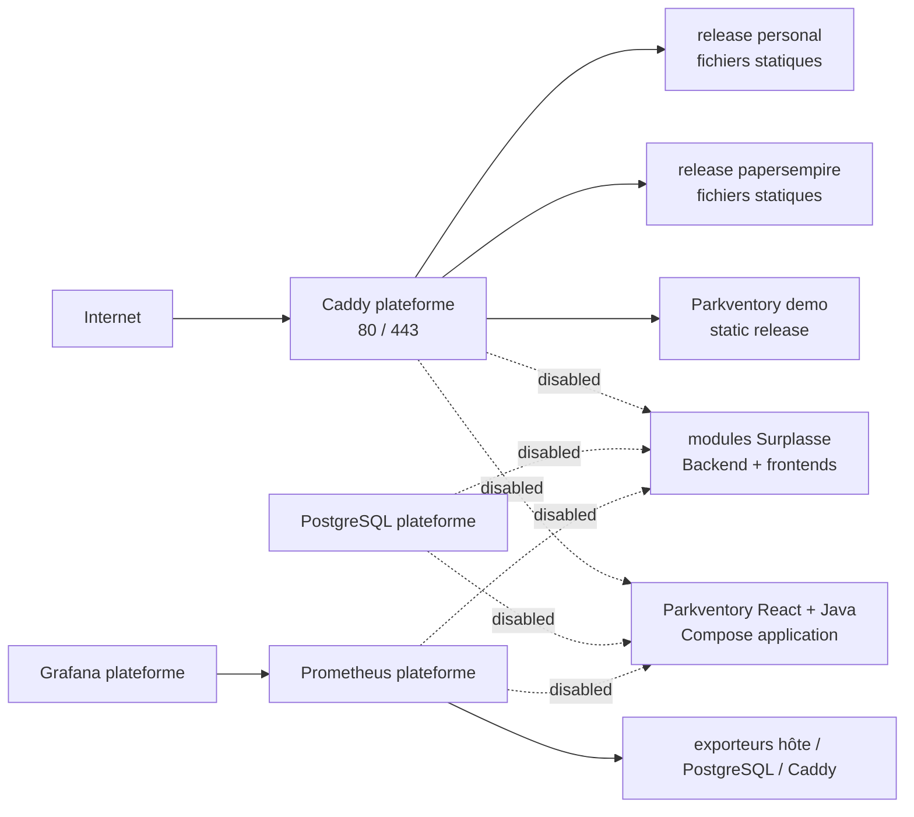

# Architecture cible du VPS

## Objet et niveau de preuve

This document describes both the proved static production boundary and the
not-yet-activated target architecture for Compose applications. Dated facts
remain historical evidence and must be verified again before an operation.

The project states consolidated on 2026-08-18 are:

| Project | Proved state | VPS consequence |
|---|---|---|
| `personal` | Immutable site and route artifacts from `163b9c9643dd9c54e9b1bb5d558d34a670e28e52` are active on Atlas. | Keep the allowlisted static producer and automatic reconciliation. |
| `papersempire` | The assembled `site/` and route inventory from `b95f9bdde468aac9d03bd0548c7aa42969e52df7` are active on Atlas. | Publish the CI result, never the checkout. |
| `parkventory` | The static demo from `db9571cc59d0fcc31c6554af259eda4c29988a6a` is active. Backend, frontend, integration, and application-release artifacts exist but are not active. | Keep the Compose application disabled until the explicit ownership handoff and all ADR-0010 blockers pass. |
| `surplasse` | An immutable tester release and integration bundle exist. Canonical admission is enabled, but no Atlas application activation is proved. | Keep the legacy adapter locked and require every canonical secret, edge, migration, recovery, and public-probe check before activation. |

The exact active static tuples and public probes are in the
[2026-08-18 rollout evidence](evidence/2026-08-18-static-reconciliation-rollout.md).
The older repository audit in [references](references.md) remains historical
and is not current production state.

## Objectifs

- réinstaller l’hôte et tous les services à partir de Git, d’artefacts
  immuables et de secrets récupérés hors du VPS ;
- ne déployer qu’une fois les services réellement communs ;
- isoler les applications, leurs données, leurs secrets et leurs rythmes de
  livraison ;
- connaître le commit source et le digest exact de chaque élément actif ;
- rendre les mises à jour et retours arrière reproductibles ;
- garder un niveau d’exploitation adapté à un VPS unique et un opérateur.

## Hors périmètre immédiat

- haute disponibilité et bascule automatique vers un second VPS ;
- Kubernetes ou orchestration multi-nœuds ;
- stockage objet des images et uploads ;
- politique complète de sauvegarde hors site et restauration des données ;
- centralisation des logs avec Loki et traces avec Tempo ;
- réplication PostgreSQL.

L’infrastructure peut être reconstruite sans ces sujets. Les données métier ne
peuvent pas l’être : sans sauvegarde restaurée, PostgreSQL repart vide puis
Flyway crée uniquement les schémas. Le contrôleur local décrit dans
[`operations/postgresql-backup.md`](operations/postgresql-backup.md) crée des
dumps et répète une restauration isolée. Il ne constitue pas une sauvegarde de
sinistre tant qu'aucune copie chiffrée hors d'Atlas n'existe.

## Vue d’ensemble



La frontière importante est le cycle de vie :

- **hôte** : convergé par Ansible ;
- **plateforme** : Caddy, PostgreSQL, Prometheus, Grafana et exporteurs ;
- **applications** : releases statiques ou conteneurs propres à un projet ;
- **données** : volumes PostgreSQL et futurs fichiers métier ;
- **état désiré** : manifeste de production versionné dans `vps-infra`.

Une mise à jour d’application ne doit jamais appeler `compose up` sur la
plateforme.

## Couche hôte : Ansible

Ansible est exécuté depuis un poste de confiance ou un runner GitHub contrôlé,
pas comme un agent permanent privilégié sur le VPS. Il gère au minimum :

- comptes administrateur et de déploiement ;
- clés SSH, interdiction du login root et des mots de passe ;
- pare-feu autorisant seulement SSH, 80 et 443 ;
- mises à jour de sécurité, fuseau, synchronisation du temps et swap ;
- dépôt APT officiel Docker, Engine et plugin Compose ;
- configuration de rotation des logs Docker ;
- répertoires `/srv/vps`, `/srv/vps/releases`, `/srv/www` et `/etc/vps` ;
- réseaux Docker externes et unités systemd nécessaires ;
- outils de récupération d’artefacts, épinglés et vérifiés ;
- Codex CLI autonome pour les travaux bornés, avec un compte runtime sans
  sudo, Docker, SSH direct ni accès aux états de production, et un App Server
  sur socket Unix privé pour une passerelle SSH optionnelle ou un relais mobile
  sortant ;
- permissions des secrets matérialisés.

Java, Node, Maven, npm, PostgreSQL, Caddy, Prometheus et Grafana ne sont pas
installés directement sur l’hôte. Les builds appartiennent aux runners CI.
Codex ne change pas cette règle : son paquet autonome ne fournit aucune
toolchain applicative et son espace de travail est séparé de `/srv/vps`.
Son App Server n'expose aucun port et reste dans la même slice systemd bornée.
Après la convergence prouvée du 2026-08-18,
`atlas-codex-app-server.service` était actif et `running` sur ce socket privé.

Un second passage Ansible doit être sans changement. Le mode
`ansible-playbook --check --diff` fait partie de la validation, tout en gardant
à l’esprit que tous les modules ne simulent pas parfaitement leurs effets.

## Couche plateforme : un seul Compose

La pile plateforme possède son propre projet Compose et son propre cycle de
release. Elle contient :

| Service | Exposition | État | Propriétaire |
|---|---|---|---|
| Caddy | `80/tcp`, `443/tcp`, éventuellement `443/udp` | volumes ACME reconstructibles | `vps-infra` |
| PostgreSQL | aucune publication hôte | volume métier critique | `vps-infra` |
| Prometheus | aucune publication hôte | historique à rétention bornée | `vps-infra` |
| Grafana | boucle locale ou tunnel SSH uniquement | configuration canonique dans Git | `vps-infra` |
| Node Exporter | privé | sans état | `vps-infra` |
| PostgreSQL Exporter | privé, compte de lecture dédié | sans état | `vps-infra` |

Un Blackbox Exporter interne peut vérifier les routes, mais il ne remplace pas
une sonde réellement externe : si le VPS tombe, son propre moniteur tombe avec
lui. Alertmanager et un canal de notification réellement testé sont une phase
distincte.

Toutes les images amont portent un tag lisible et un digest. Renovate propose
les mises à jour dans le dépôt VPS ; les versions majeures, Caddy et PostgreSQL
ne sont jamais fusionnés automatiquement.

## Shared Caddy service

Caddy is the only owner of public ports and TLS certificates. The locked base
platform imports no application route. Each versioned route candidate has a
`.disabled` suffix:

```text
platform/caddy/
  Caddyfile
  routes/
    personal.caddy.disabled
    papersempire.caddy.disabled
    parkventory.caddy.disabled
    surplasse.caddy.disabled
```

The first live unit is `vps-public-static-edge`. It is a separate Compose
project with exactly one Caddy service and exactly three static route files. It
mounts the verified `current` roots for Personal, Papers Empire, and the
Parkventory demo read-only.
It keeps separate ACME volumes and does not receive a DNS provider credential.
It joins only the dedicated external `edge` bridge. It does not join the
internal observability network `ops`.
The bounded deployment playbook does not enable the locked release applicator
or start any internal platform service.

The edge has three immutable route releases. Preparation is HTTP-only and can be
probed directly against the Atlas address before DNS changes. HTTPS activation
is allowed only after every authoritative A answer contains Atlas and all old
AAAA answers are gone. A root-owned symlink switches between revisioned
releases atomically; failed reconciliation restores the previous target.

This sequencing does not remove the shared services. PostgreSQL, Prometheus,
Grafana, Node Exporter, and PostgreSQL Exporter remain the internal platform
for Surplasse and Parkventory. Grafana stays on host loopback and the other
internal services publish no host port. Caddy remains the only Internet
request entry point.

`scripts/validate-application-state` rejects every enabled application in this
baseline. A reviewed integration revision must replace that locked policy. It
must activate the route, required network attachment, and required secret
mounts in one versioned change.

The Surplasse route candidate must preserve these requirements:

- domaine apex, API, Dashboard, documentation et sous-domaines établissements ;
- certificat wildcard par DNS-01 ;
- frontière CORS distincte par interface ;
- transmission SSE sans buffering ;
- refus public de tout `/q/*` (métriques, health détaillée, OpenAPI et
  Swagger) ;
- healthcheck public dédié.

The platform Caddy image compiles the DNS module once. The generated entry
point, full `go.mod`, and `go.sum` lock the complete graph. The build rejects a
graph change with `-mod=readonly`. The graph uses `cel-go` v0.29.2. A committed
patch applies the two-line compatibility change from Caddy upstream commit
`b2693fb63a30e6d7be0972c3645e9a2c0a500e93` to Caddy v2.11.4. The build checks
the patched file checksum before compilation. Architecture-specific Alpine
fixes use exact URLs and SHA-256 values, then install with network access
disabled. The pull request workflow scans native `amd64` and `arm64` images.
The publication workflow scans both exact child manifest digests before it
creates GitHub provenance. The zone-scoped provider identity remains a separate
implementation gate. It must not be inferred from a local environment or a
build credential.

La stratégie TLS de bascule doit éviter un cercle vicieux. Personal et Papers
Empire utilisent le chemin HTTP-01 à deux phases décrit plus haut : préparation
HTTP, bascule contrôlée des A, suppression des anciens AAAA, puis activation
HTTPS avec retour rapide vers l’ancien hébergement. DNS-01 reste prévu pour les
routes qui exigent réellement un wildcard, notamment Surplasse, avec un jeton
distinct et limité par zone. Une probe publique normale avant bascule testerait
encore GitHub Pages, pas le VPS.

Avant tout rechargement :

1. rendre la configuration complète ;
2. exécuter `caddy validate` dans l’image exacte ;
3. lancer des probes locales avec les bons en-têtes `Host` ;
4. recharger sans redémarrer les applications ;
5. lancer des probes publiques avec validation TLS stricte.

## Sites statiques sans runtime dupliqué

Personal, Papers Empire, and the Parkventory demo are served directly by Caddy:

```text
/srv/www/
  personal/
    releases/sha256-<site-manifest-digest>/
    current -> releases/sha256-<site-manifest-digest>
  papersempire/
    releases/sha256-<site-manifest-digest>/
    current -> releases/sha256-<site-manifest-digest>
  parkventory/
    releases/sha256-<site-manifest-digest>/
    current -> releases/sha256-<site-manifest-digest>
```

The Parkventory static release contains only the explicitly labeled demo. Its
Compose application remains disabled. The static route has no proxy or API
handler and does not prove backend readiness.

This is a temporary delivery mode, not the final Parkventory topology. The
production application will contain a React frontend image and a Java backend
image, plus a dedicated migrator and integration bundle. The versioned static
and application contracts are mutually exclusive. Before the Compose release
can own `parkventory.com`, the static promotion must be disabled, in-flight
static work drained, and the route transferred under a shared host lock.

Each CI workflow creates a static archive, calculates its checksum, and
publishes it as an OCI artifact in GHCR. The VPS manifest references its digest,
not a mutable tag. ORAS remains pinned in the local and CI publication tooling.
The host materializer downloads registry objects directly with transfer limits
and verifies their digests. It does not depend on ORAS.

The source SHA remains a required annotation, but the release name uses the
artifact digest. The same commit rebuilt in another environment can produce
different bytes.

The implemented OCI envelope uses these exact versioned media types:

- site artifact: `application/vnd.vps-infra.static-site.v1`;
- site layer: `application/vnd.vps-infra.static-site.v1+tar+gzip`;
- inventory artifact: `application/vnd.vps-infra.route-inventory.v1`;
- inventory layer: `application/vnd.vps-infra.route-inventory.v1+json`;
- integration artifact: `application/vnd.vps-infra.platform-integration.v1`;
- integration archive layer:
  `application/vnd.vps-infra.platform-integration.v1+tar+gzip`;
- integration inventory layer:
  `application/vnd.vps-infra.platform-integration.inventory.v1+json`.

The site and route manifests contain one layer. The integration manifest
contains its deterministic archive and canonical inventory. All three
manifests use exact configs and exact `source`, `revision`, and `created`
annotations. The standalone `deploy-static` primitive:

1. checks the application against an allowlist;
2. accepts the full application revision and full platform integration
   revision, plus exact site, route, integration, and Caddy digests;
3. downloads each site, route, and integration manifest or payload in a
   network-enabled systemd `DynamicUser` execution with an in-transfer size
   limit, then copies it as root while it verifies the caller-known digest;
   payload copies also use the exact size from a reconstructed manifest;
4. verifies separate site, route, and integration attestations against the
   exact repository, full revision, source ref, and signer workflow, and rejects
   self-hosted signers;
5. verifies each manifest and layer, the profile limits, canonical inventories,
   and the archive-to-inventory bijection;
6. rejects absolute paths, `..` traversal, symbolic links, hard links, devices,
   sockets, and decompression bombs;
7. runs all untrusted manifest, gzip, tar, inventory, package, and attestation
   parsing in short-lived systemd `DynamicUser` units on a dedicated bounded
   tmpfs;
8. extracts the site and exact integration package with safe `openat`
   operations, then makes the complete release root-owned;
9. fsyncs every file and then each directory from the deepest directory to the
   release root;
10. probes the new root with temporary Caddy from the exact platform image and
    does not use the virtual host that still points to `current`;
11. renames the release to the site OCI manifest digest, fsyncs its parent, and
    atomically replaces the `current` symlink;
12. restores and fsyncs the previous `current` target if the activation fsync
    fails after replacement.

The automated static form adds a second, narrower state machine around that
primitive. GitHub Actions in `vps-infra` resolves only the exact canonical HEAD
whose observed check-run set is finished and non-failing and whose configured
required checks are successful, then converts the two
`sha-<HEAD>` tags to immutable manifest digests. Atlas independently confirms
the HEAD and proves in a bounded `DynamicUser` worker that a new revision
descends from the managed active revision. It writes a transaction, switches the symlink, and probes the real edge
with normal public TLS validation. A successful probe persists the full source,
site, routes, integration, and Caddy tuple plus its protected route inventory.
A failed probe restores the previous target first, then quarantines that exact
tuple if the source HEAD and Caddy identity remain unchanged. Recovery also
quarantines it conservatively if classification was interrupted; only a durable
`superseded` phase keeps it retryable.
An exact already-active tuple verifies the local filesystem, Caddy runtime, and
a bounded public TLS sample without fetching GHCR again. The generic dynamic
controller remains locked.

A separate network-enabled `DynamicUser` execution uses the checksum-pinned
GitHub CLI and its embedded TUF bootstrap roots to obtain one current Sigstore
trusted-root snapshot per deployment. Its runtime, memory, per-file size,
inode, and tmpfs use are bounded. GitHub CLI does not expose an in-transfer
size limit for this TUF operation. The root orchestrator validates and copies
the two-record root only when it matches the versioned SHA-256. A root rotation
fails closed until a reviewed repository update changes that digest. The
orchestrator removes the fetch state and reuses that exact snapshot for all
three attestations. Other network-enabled executions download bounded
attestation objects. The root orchestrator copies each exact bundle set and
removes its execution state. A separate sequential offline execution of the
same fixed transient unit gives the root-owned bundle, trusted root, and local
OCI manifest to GitHub CLI through `--bundle` and `--custom-trusted-root`. The
fixed unit name prevents concurrent worker creation. Success depends only on
the verifier exit code after the full cgroup exits. GitHub CLI receives no
credential. The attested source ref is not a branch-protection proof.
Repository branch protection remains a separate production gate.

The exact integration package retains each route with a `.disabled` suffix.
The materializer copies only the selected application route to a temporary
probe tree and removes the suffix from that copy. It first runs `caddy validate`
against the exact packaged Caddyfile and temporary routes. It then adds
`local_certs` exactly once to another temporary copy and starts an HTTPS probe
on loopback. The probe requests every inventory route and compares its response
checksum. It also checks the 404 body, the `no-cache` HTML policy, the
`public, max-age=3600` asset policy, gzip for a payload larger than 1 KiB,
security headers, and configured redirects.

The Caddy digest must match both the protected `CADDY_PLATFORM_IMAGE` promotion
point and the exact integration package, but the platform does not have to be
active. A failed validation or probe leaves `current` unchanged. Activation
uses protected directory file descriptors and an exact relative symlink target.
The local certificate probe remains the pre-activation content and integration
proof. The separate live form follows it with a strict TLS probe against the
running public edge, persistent transaction recovery, rollback, active state,
and quarantine. The activation runs in a transient systemd unit with a recovery
stop hook; a boot oneshot completes recovery before the systemd-managed public
edge unit. Docker may still restart the existing Caddy container when the
daemon starts before that ordering is applied. A policy
that garbage-collects old releases is still pending. Recovery validates managed
release bytes against the protected inventory and removes bounded labeled
probe containers, staging directories, and temporary symlinks. The locked dynamic
controller cannot invoke this primitive.

For `personal`, CI must build the public directory from an allowlist. The
checkout contains files such as `AGENTS.md`, `infos/`, and `.claude/`. These
files must never enter the web root. The same allowlist generates the route
inventory. Temporary Caddy probes all EN/FR, Work, CV, Blog, article,
Dashboard, Claude, `v2022` archive, error-page, and asset file routes. Domain
redirects are not file routes. The live activation and external public probes
test them separately. This inventory prevents a new file route from being omitted from a
handwritten smoke test.

Pour `papersempire`, l’artefact est le répertoire `site/` déjà assemblé par le
workflow : jeu, Dashboard, documentation Retype et pages de langue. Servir le
checkout omettrait la documentation construite et les pages générées.

Le domaine et le schéma de Papers Empire restent
`https://papersempire.com`. Sa sauvegarde navigateur vit dans `localStorage` et
est liée à cette origine.

## Applications conteneurisées

Chaque application possède un Compose de production indépendant ne contenant
que ses processus :

### Surplasse

- Backend Quarkus ;
- Onboarding ;
- Commande ;
- Dashboard ;
- documentation Nimbus si elle est réellement servie par le VPS.

Les services `edge`, `postgresql`, `prometheus` et `grafana` quittent le Compose
Surplasse. Le backend reçoit un hostname PostgreSQL externe et n’a plus de
`depends_on` vers un service local. Les cinq images sont épinglées séparément
par digest et toutes sont liées à la même révision source globale. Le workflow
actuel reconstruit et publie la matrice fixe de cinq images à chaque push sur
`main`, même pour une modification isolée. Une publication sélective serait une
optimisation future, pas une garantie actuelle.

Surplasse publie en plus un artefact OCI `vps-integration` versionné par digest :
fragment Caddy, targets et règles Prometheus, dashboards Grafana, inventaire des
migrations et probes. `vps-infra` valide ce paquet puis le référence dans le
manifeste. Ces fichiers ne sont ni copiés manuellement ni supposés synchronisés
avec les images.

### Parkventory

Parkventory now publishes immutable Backend, Frontend, integration, and
`application-release` artifacts from its canonical branch. This closes the
producer packaging task. It does not make the application deployable.

Production remains disabled until the reviewed contract proves the OIDC
provider, CORS and cookie policy, SMTP and Swagger policy, file-backed secrets,
forced RLS and negative tenant-isolation tests, exact PostgreSQL compatibility,
restore evidence, metrics and structured logs, protected branch, resource and
retention budgets, route handoff, recovery, and strict public probes. The
static demo must release `parkventory.com` under the shared lock before any
Compose preflight or migration. Mailpit, Vite development mode, and the Maven
development image never join the production VPS.

### Mon Florian

Mon Florian has one backend image and one immutable integration bundle. Its
admission profile remains disabled. It uses only `app_monflorian`, publishes no
host port, and has migration strategy `none`: there is no application database,
migration runner, or migrator service. The only runtime secret is the OpenAI
API key allocated to the backend through a file-backed secret. The inactive
Caddy route requires a separately materialized private-access snippet.

## Network isolation

Ansible creates eight external Docker networks. The isolated public edge and
the locked complete platform definition use these memberships:

```text
app_surplasse       empty
db_surplasse        PostgreSQL
app_parkventory     empty
db_parkventory      PostgreSQL
app_monflorian      empty
edge                isolated public static edge Caddy
db_monitoring       PostgreSQL, PostgreSQL Exporter
ops                 locked complete platform Caddy, Prometheus, Grafana, exporters
```

The isolated public static edge has no `ops` attachment. The host layout owns
`edge` as a managed non-internal bridge on `172.30.32.0/24`. The Compose policy
and runtime inspection require this one-network membership.

A reviewed integration package attaches a platform service or an application
service only to the required application network. PostgreSQL joins
`db_monitoring`, `db_surplasse`, and `db_parkventory`. PostgreSQL Exporter joins
`db_monitoring` and `ops`. Caddy, Grafana, and Prometheus have no direct TCP
path to PostgreSQL.
The exporter role has only `pg_monitor` and `pg_hba.conf` limits it to the
`db_monitoring` subnet.

Aucun service applicatif ne publie de port. Grafana peut écouter sur
`127.0.0.1` seulement et s’ouvrir par tunnel SSH. Les endpoints de métriques,
health détaillée et Swagger restent privés même si Caddy partage un réseau avec
le backend.

## PostgreSQL partagé

La mutualisation signifie **un cluster physique**, pas une base ou un compte
partagé :

| Projet | Base | Rôles minimaux |
|---|---|---|
| Surplasse | `surplasse` | owner sans login, migrateur, runtime |
| Parkventory | `parkventory` | owner sans login, migrateur, runtime |

Pour chaque base :

- `REVOKE CONNECT ON DATABASE … FROM PUBLIC` puis droits explicites ;
- owner `NOLOGIN`, migrateur autorisé à `SET ROLE`, runtime sans DDL ;
- retrait de `CREATE` public sur les schémas ;
- `search_path` fixé et non contrôlé par l’utilisateur ;
- `ALTER DEFAULT PRIVILEGES` appliqué par l’owner pour les objets futurs ;
- limites de connexions par rôle ;
- lignes `pg_hba.conf` limitées à la base, au rôle et au sous-réseau applicatif,
  avec authentification SCRAM ;
- secrets différents par rôle et par projet.

Aucun compte applicatif n’est superutilisateur. Les extensions comme
`btree_gist` sont provisionnées par l’administrateur ou le migrateur, jamais par
le runtime.

### Version initiale

Surplasse a une ADR acceptée pour PostgreSQL 17 et épingle 17.10 dans son
catalogue de production ; ses tests actuels utilisent toutefois le tag majeur
`postgres:17`, pas exactement 17.10. Parkventory a une ADR acceptée pour
PostgreSQL 18 et utilise aujourd’hui 18.3, sans donnée de production.

La cible initiale proposée reste PostgreSQL **17.10**, mais elle exige :

- une matrice exacte 17.10/18.3 pour Parkventory couvrant V1, V1→V2,
  `btree_gist`, contraintes et version serveur réelle ;
- une gate Surplasse exécutée contre l’image 17.10 exacte ;
- une ADR Parkventory qui remplace explicitement le choix 18 si 17.10 est
  retenu.

Si Parkventory n’est pas compatible, le premier choix est de retarder son
activation. Une exception avec un second cluster PostgreSQL 18 peut être
acceptée par ADR si le besoin produit l’impose ; elle assume alors la
duplication que la plateforme cherchait à éviter. Migrer le cluster partagé
vers 18 n’est qu’une troisième option et exige de remplacer l’ADR Surplasse,
valider les deux projets et répéter sauvegarde/restauration.

Les mises à jour mineures sont des releases plateforme planifiées. Une mise à
jour majeure n’est jamais un déploiement applicatif ordinaire.

## Shared Prometheus and Grafana services

The locked platform loads only platform targets and platform rules. It keeps
the Surplasse target and rule as inactive candidates:

```text
platform/observability/
  prometheus/
    prometheus.yml
    targets/
      caddy.yml
      node-exporter.yml
      postgres-exporter.yml
      surplasse.yml.disabled
    rules/
      platform.yml
      surplasse.yml.disabled
  grafana/
    provisioning/
    dashboards/
      platform/
      surplasse/
```

A reviewed Surplasse integration must activate both files and add the related
Prometheus job in the same versioned change. The base platform must not produce
an alert for a disabled application.

Les cibles utilisent des labels bornés comme `project` et `environment`, jamais
un email, une commande, un établissement ou un jeton. Le dashboard Surplasse
existant reste versionné et est déplacé ou synchronisé vers son dossier.

Au premier palier :

- Prometheus se collecte lui-même ;
- Surplasse expose `/q/metrics` en privé ;
- Parkventory ajoute Micrometer avant activation ;
- Node Exporter mesure CPU, mémoire, disque et inodes ;
- PostgreSQL Exporter observe le cluster avec un compte de lecture dédié ;
- Caddy expose ses métriques en privé si son image et sa configuration le
  permettent.

Les dashboards et sources Grafana sont provisionnés depuis l’état versionné par
le manifeste. Les paquets d’intégration applicatifs sont validés par
`vps-infra` avant d’être matérialisés ; les changements utiles réalisés dans
l’interface doivent être exportés et revus. Le volume Grafana n’est pas une
source canonique.

## Ce qui est mutualisé — et ce qui ne l’est pas

| Mutualisé une fois | Conservé par application |
|---|---|
| configuration de l’hôte | code et tests |
| Caddy et certificats | processus Backend/Frontend |
| cluster PostgreSQL | base, rôles et migrations |
| Prometheus et Grafana | métriques et règles métier |
| exporteurs hôte et base | secrets applicatifs |
| réseaux et mécanique de déploiement | cadence de release et rollback |

Il ne faut pas chercher à partager un processus JVM, un `node_modules`, un
conteneur NGINX ou un volume de code entre applications. Les images conteneur
réutilisent déjà leurs couches identiques de manière adressée par contenu ; la
faible duplication restante achète l’isolation des releases.

## Arborescence cible du dépôt

```text
vps-infra/
  ansible/
    inventories/production/
    playbooks/bootstrap.yml
    playbooks/site.yml
    roles/base/
    roles/docker/
    roles/firewall/
    roles/layout/
    roles/deploy/
  platform/
    compose.yaml
    caddy/
    postgres/
    observability/
  apps/
    surplasse/compose.yaml
    parkventory/compose.yaml
  releases/
    production.yaml
  scripts/
    deploy
    deploy-application
    deploy-application-live-gate
    deploy-static
    reconcile
    doctor
  systemd/
  secrets/
    README.md
    registry.json
  schemas/
    secret-registry.schema.json
  docs/
```

The repository-delivered disabled Compose controller is designed to materialize
immutable releases below
`/srv/applications/<application>/releases` and keeps root-only active,
inventory, transaction, and quarantine records below
`/var/lib/vps-application`. It shares `/run/lock/vps-static.lock` with the
static controller. After convergence, its boot recovery unit is ordered before
the systemd-managed public edge, subject to the Docker restart bypass recorded
by ADR-0010. The 2026-08-18 rollout converged revision
`da04a09bfa9788ae8127b63f9f3a6692bef2551b`; the application controller and
root gate are installed, and its recovery service completed successfully before
returning inactive. This is installation evidence only. An application cannot
reach its dedicated migration until its protected contract entry is enabled,
Parkventory no longer has a static owner, and the immutable public edge already
contains the exact attested route and application-network attachment. Route
preparation remains a platform responsibility and precedes migration. Both
legacy entries remain `enabled: false`. The canonical Surplasse tester entry is
enabled. Parkventory has a manual workflow that resolves no deployment matrix
while its canonical entry is disabled; no active runtime follows from admission.

The versioned secret registry contains public metadata only. It records the
expected path, permissions, consumer, target generation, generation binding,
and last observed host state. It separates planned, materialized, and
runtime-loaded states. A metadata audit can mark a file materialized, but only
a non-secret marker written by the bounded materializer can bind that file set
to a generation. The Parkventory materializers write markers for their two
exact sets. Other materializers do not. A materialized file is not runtime
proof.

The repository has no SOPS payload, no `.sops.yaml` policy, and no proved age
recovery identity. SOPS recovery remains blocked. Until a later reviewed change
proves that recovery path, required values stay in an approved external secret
store. The registry reports value recovery as `not-configured`. Decrypted
values remain under `/etc/vps/secrets` and never enter Git or shared Compose
output. See
[ADR-0017](decisions/0017-versioned-atlas-secret-registry.md) and the
[secret contract](../secrets/README.md).

Le dépôt `vps-infra` est public au démarrage : le VPS le récupère en HTTPS sans
identité Git, ce qui supprime un secret de reconstruction. Cette visibilité
n’autorise aucun inventaire réel, IP privée, nom d’utilisateur, secret ou
fichier déchiffré dans Git. Si le dépôt devient privé, une deploy key en lecture
seule devra être ajoutée ; elle restera distincte de la clé GHCR et de la clé
SSH utilisée par GitHub Actions pour déclencher le wrapper.

## Solutions volontairement non retenues

- un Caddy ou un PostgreSQL par dépôt ;
- Watchtower et les tags `latest` ;
- compilation Maven/npm sur la production ;
- un runner GitHub Actions persistant installé sur le VPS ;
- un compte de déploiement membre du groupe `docker` pour chaque dépôt ;
- montage du socket Docker dans Caddy pour découvrir automatiquement les
  routes ;
- `git pull && docker compose up` sans commit et digests explicites ;
- `docker system prune -af` aveugle ;
- modification manuelle de la production comme source de vérité.
