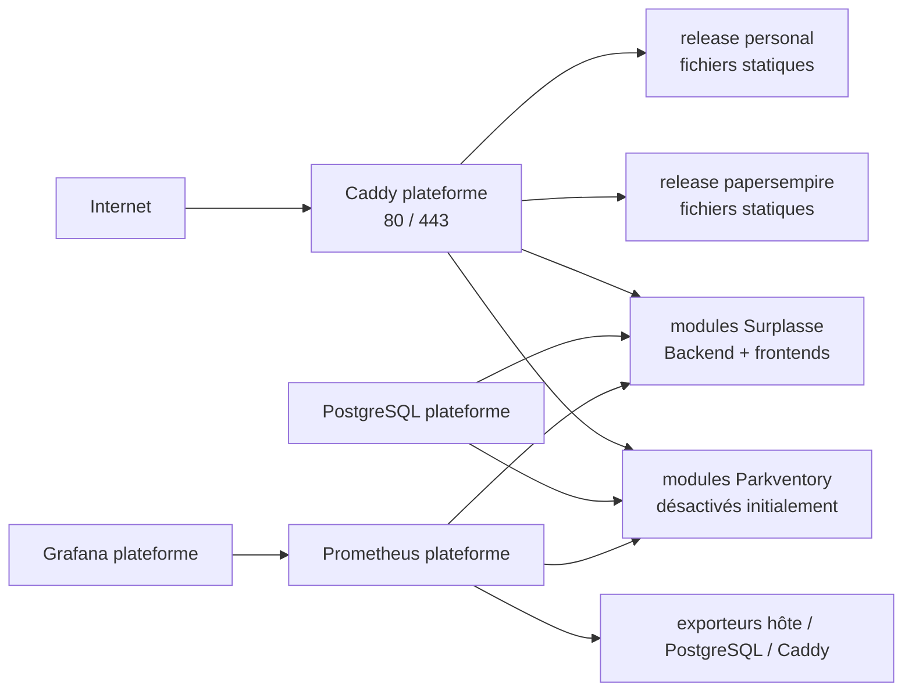

# Architecture cible du VPS

## Objet et niveau de preuve

Ce document décrit la cible proposée après audit des dépôts locaux et de leurs
workflows le 30 juillet 2026. Il ne décrit pas une production déjà
provisionnée.

Les états observés sont historiques et devront être revérifiés au moment de
l’implémentation :

| Projet | État réellement observé | Conséquence VPS |
|---|---|---|
| `personal` | Site HTML/CSS/JS sans build runtime, actuellement publié directement par GitHub Pages | Produire une allowlist publique et servir une release statique |
| `papersempire` | Jeu statique ; Retype et `build-lang-pages.mjs` assemblent le répertoire final `site/` | Publier exactement le résultat de CI, jamais le checkout |
| `parkventory` | Démo Pages et Compose de développement avec Maven, Vite, Mailpit et PostgreSQL 18.3 ; aucun artefact de production | Projet désactivé dans le manifeste de production jusqu’aux portes dédiées |
| `surplasse` | Cinq images applicatives GHCR par SHA ; Caddy, PostgreSQL 17.10, Prometheus 3.13.1 et Grafana 13.1.1 encore intégrés à son Compose | Extraire les quatre services communs et conserver seulement les modules applicatifs |

Au dernier contrôle du 30 juillet 2026, Parkventory était propre au commit
`21f711c684d3`. Ce commit décrit toujours une démo sans artefact ni cible de
production. L’ADR choisit le flux OIDC passwordless pour la production, mais le
fournisseur reste à sélectionner ; l’adaptateur maison reste un outil local et
ne devient pas implicitement le fournisseur de production. Le worktree
Surplasse contient également des fichiers non suivis et son garde-fou actuel
refuserait un déploiement depuis ce checkout.

## Objectifs

- réinstaller l’hôte et tous les services à partir de Git, d’artefacts
  immuables et de secrets récupérés hors du VPS ;
- ne déployer qu’une fois les services réellement communs ;
- isoler les applications, leurs données, leurs secrets et leurs rythmes de
  livraison ;
- connaître le commit source et le digest exact de chaque élément actif ;
- rendre les mises à jour et retours arrière reproductibles ;
- garder un niveau d’exploitation adapté à un VPS unique et un opérateur.

## Hors périmètre immédiat

- haute disponibilité et bascule automatique vers un second VPS ;
- Kubernetes ou orchestration multi-nœuds ;
- stockage objet des images et uploads ;
- politique complète de sauvegarde et restauration des données ;
- centralisation des logs avec Loki et traces avec Tempo ;
- réplication PostgreSQL.

L’infrastructure peut être reconstruite sans ces sujets. Les données métier ne
peuvent pas l’être : sans sauvegarde restaurée, PostgreSQL repart vide puis
Flyway crée uniquement les schémas.

## Vue d’ensemble



La frontière importante est le cycle de vie :

- **hôte** : convergé par Ansible ;
- **plateforme** : Caddy, PostgreSQL, Prometheus, Grafana et exporteurs ;
- **applications** : releases statiques ou conteneurs propres à un projet ;
- **données** : volumes PostgreSQL et futurs fichiers métier ;
- **état désiré** : manifeste de production versionné dans `vps-infra`.

Une mise à jour d’application ne doit jamais appeler `compose up` sur la
plateforme.

## Couche hôte : Ansible

Ansible est exécuté depuis un poste de confiance ou un runner GitHub contrôlé,
pas comme un agent permanent privilégié sur le VPS. Il gère au minimum :

- comptes administrateur et de déploiement ;
- clés SSH, interdiction du login root et des mots de passe ;
- pare-feu autorisant seulement SSH, 80 et 443 ;
- mises à jour de sécurité, fuseau, synchronisation du temps et swap ;
- dépôt APT officiel Docker, Engine et plugin Compose ;
- configuration de rotation des logs Docker ;
- répertoires `/srv/vps`, `/srv/vps/releases`, `/srv/www` et `/etc/vps` ;
- réseaux Docker externes et unités systemd nécessaires ;
- outils de récupération d’artefacts, épinglés et vérifiés ;
- permissions des secrets matérialisés.

Java, Node, Maven, npm, PostgreSQL, Caddy, Prometheus et Grafana ne sont pas
installés directement sur l’hôte. Les builds appartiennent aux runners CI.

Un second passage Ansible doit être sans changement. Le mode
`ansible-playbook --check --diff` fait partie de la validation, tout en gardant
à l’esprit que tous les modules ne simulent pas parfaitement leurs effets.

## Couche plateforme : un seul Compose

La pile plateforme possède son propre projet Compose et son propre cycle de
release. Elle contient :

| Service | Exposition | État | Propriétaire |
|---|---|---|---|
| Caddy | `80/tcp`, `443/tcp`, éventuellement `443/udp` | volumes ACME reconstructibles | `vps-infra` |
| PostgreSQL | aucune publication hôte | volume métier critique | `vps-infra` |
| Prometheus | aucune publication hôte | historique à rétention bornée | `vps-infra` |
| Grafana | boucle locale ou tunnel SSH uniquement | configuration canonique dans Git | `vps-infra` |
| Node Exporter | privé | sans état | `vps-infra` |
| PostgreSQL Exporter | privé, compte de lecture dédié | sans état | `vps-infra` |

Un Blackbox Exporter interne peut vérifier les routes, mais il ne remplace pas
une sonde réellement externe : si le VPS tombe, son propre moniteur tombe avec
lui. Alertmanager et un canal de notification réellement testé sont une phase
distincte.

Toutes les images amont portent un tag lisible et un digest. Renovate propose
les mises à jour dans le dépôt VPS ; les versions majeures, Caddy et PostgreSQL
ne sont jamais fusionnés automatiquement.

## Shared Caddy service

Caddy is the only owner of public ports and TLS certificates. The locked base
platform imports no application route. Each versioned route candidate has a
`.disabled` suffix:

```text
platform/caddy/
  Caddyfile
  routes/
    personal.caddy.disabled
    papersempire.caddy.disabled
    parkventory.caddy.disabled
    surplasse.caddy.disabled
```

`scripts/validate-application-state` rejects every enabled application in this
baseline. A reviewed integration revision must replace that locked policy. It
must activate the route, required network attachment, and required secret
mounts in one versioned change.

The Surplasse route candidate must preserve these requirements:

- domaine apex, API, Dashboard, documentation et sous-domaines établissements ;
- certificat wildcard par DNS-01 ;
- frontière CORS distincte par interface ;
- transmission SSE sans buffering ;
- refus public de tout `/q/*` (métriques, health détaillée, OpenAPI et
  Swagger) ;
- healthcheck public dédié.

Le module DNS est compilé une seule fois dans l’image Caddy plateforme, avec une
version ou un commit explicite. Le fournisseur et le jeton limité à la zone
restent une porte de mise en œuvre ; ils ne doivent pas être déduits de
l’environnement local.

La stratégie TLS de bascule doit éviter un cercle vicieux. La préférence est
DNS-01 pour chaque zone de production, avec un jeton distinct et limité par
zone : le certificat peut alors être émis avant de modifier A/AAAA. Le nouvel
hôte est sondé avec `--resolve <domaine>:443:<nouvelle-ip>`. Si une zone ne
permet pas DNS-01, il faut soit un hostname de préproduction, soit une bascule
DNS contrôlée avant émission HTTP-01 avec un retour rapide vers l’ancien
hébergement. Une probe publique normale avant bascule testerait encore GitHub
Pages, pas le VPS.

Avant tout rechargement :

1. rendre la configuration complète ;
2. exécuter `caddy validate` dans l’image exacte ;
3. lancer des probes locales avec les bons en-têtes `Host` ;
4. recharger sans redémarrer les applications ;
5. lancer des probes publiques avec validation TLS stricte.

## Sites statiques sans runtime dupliqué

`personal` et `papersempire` sont servis directement par Caddy :

```text
/srv/www/
  personal/
    releases/<digest-artefact>/
    current -> releases/<digest-artefact>
  papersempire/
    releases/<digest-artefact>/
    current -> releases/<digest-artefact>
```

Chaque CI fabrique une archive statique, calcule son checksum et la publie comme
artefact OCI dans GHCR. Le manifeste VPS référence son digest, pas un tag
mutable. Un outil tel qu’ORAS peut tirer cet artefact par digest ; son ajout à
l’hôte doit lui-même être épinglé et vérifié.

Le SHA source reste une annotation obligatoire, mais le nom de release utilise
le digest de l’artefact : un même commit reconstruit dans un environnement
différent peut produire des octets différents.

Le contrat OCI fixe un type d’artefact, une archive déterministe, son SHA-256,
l’annotation de révision et des bornes de taille et de nombre de fichiers. Le
script générique `deploy-static` :

1. vérifie l’application contre une allowlist ;
2. télécharge le digest attendu dans un répertoire temporaire ;
3. vérifie type, checksum, taille, nombre de fichiers et archive déterministe ;
4. refuse chemins absolus, traversées `..`, symlinks, hardlinks, devices,
   sockets et bombes de décompression ;
5. extrait sans privilège dans `releases/<digest-artefact>` sans écraser une
   autre release ;
6. sonde la nouvelle racine avec un Caddy temporaire utilisant l’image
   plateforme exacte, jamais avec le vhost encore pointé sur `current` ;
7. remplace atomiquement le symlink `current` ;
8. sonde publiquement et revient au symlink précédent en cas d’échec ;
9. conserve au moins les trois dernières releases.

Pour `personal`, la CI doit construire un répertoire public par allowlist. Le
checkout actuel contient des fichiers comme `AGENTS.md`, `infos/` et `.claude/`
qui ne doivent jamais rejoindre la racine web. La même allowlist génère un
inventaire de routes : toutes les pages EN/FR, Work, CV, Blog et articles,
Dashboard, Claude, archive `v2022`, erreurs et redirections de domaines sont
sondées. Cet inventaire évite qu’une nouvelle route publique soit oubliée par
un smoke codé à la main.

Pour `papersempire`, l’artefact est le répertoire `site/` déjà assemblé par le
workflow : jeu, Dashboard, documentation Retype et pages de langue. Servir le
checkout omettrait la documentation construite et les pages générées.

Le domaine et le schéma de Papers Empire restent
`https://papersempire.com`. Sa sauvegarde navigateur vit dans `localStorage` et
est liée à cette origine.

## Applications conteneurisées

Chaque application possède un Compose de production indépendant ne contenant
que ses processus :

### Surplasse

- Backend Quarkus ;
- Onboarding ;
- Commande ;
- Dashboard ;
- documentation Nimbus si elle est réellement servie par le VPS.

Les services `edge`, `postgresql`, `prometheus` et `grafana` quittent le Compose
Surplasse. Le backend reçoit un hostname PostgreSQL externe et n’a plus de
`depends_on` vers un service local. Les cinq images sont épinglées séparément
par digest et par révision source afin qu’un changement isolé ne recrée pas tous
les modules et n’attribue pas un nouveau SHA à une image inchangée.

Surplasse publie en plus un artefact OCI `vps-integration` versionné par digest :
fragment Caddy, targets et règles Prometheus, dashboards Grafana, inventaire des
migrations et probes. `vps-infra` valide ce paquet puis le référence dans le
manifeste. Ces fichiers ne sont ni copiés manuellement ni supposés synchronisés
avec les images.

### Parkventory

La production reste désactivée tant que le dépôt ne fournit pas :

- une image Backend construite et durcie, sans `quarkus:dev` ni montage source ;
- un artefact ou une image Frontend de production ;
- un Compose de production sans ports hôte ;
- CORS, cookies, SMTP et Swagger configurés pour la production ;
- des secrets consommés par fichiers, sans fallback local ;
- un fournisseur OIDC passwordless sélectionné puis implémenté conformément à
  l’ADR-0003, l’adaptateur maison restant strictement local ;
- RLS forcée et tests négatifs d’isolation tenant A/B ;
- une restauration prouvée sur une base jetable ;
- Micrometer Prometheus et logs structurés ;
- une validation complète des migrations ;
- domaine/DNS, branche protégée, paquet d’intégration et smoke public validés.

Mailpit, Vite et l’image Maven de développement ne rejoignent jamais le VPS de
production.

## Network isolation

Ansible creates six external Docker networks. The locked base platform uses
only these memberships:

```text
app_surplasse       empty
db_surplasse        empty
app_parkventory     empty
db_parkventory      empty
db_monitoring       PostgreSQL, PostgreSQL Exporter
ops                 Caddy, Prometheus, Grafana, and exporters
```

A reviewed integration package attaches a platform service or an application
service only to the required application network. PostgreSQL and PostgreSQL
Exporter share the internal `db_monitoring` network. Only the exporter also
joins `ops`. Caddy, Grafana, and Prometheus have no direct TCP path to
PostgreSQL. The exporter role has only `pg_monitor` and `pg_hba.conf` limits it
to the `db_monitoring` subnet.

Aucun service applicatif ne publie de port. Grafana peut écouter sur
`127.0.0.1` seulement et s’ouvrir par tunnel SSH. Les endpoints de métriques,
health détaillée et Swagger restent privés même si Caddy partage un réseau avec
le backend.

## PostgreSQL partagé

La mutualisation signifie **un cluster physique**, pas une base ou un compte
partagé :

| Projet | Base | Rôles minimaux |
|---|---|---|
| Surplasse | `surplasse` | owner sans login, migrateur, runtime |
| Parkventory | `parkventory` | owner sans login, migrateur, runtime |

Pour chaque base :

- `REVOKE CONNECT ON DATABASE … FROM PUBLIC` puis droits explicites ;
- owner `NOLOGIN`, migrateur autorisé à `SET ROLE`, runtime sans DDL ;
- retrait de `CREATE` public sur les schémas ;
- `search_path` fixé et non contrôlé par l’utilisateur ;
- `ALTER DEFAULT PRIVILEGES` appliqué par l’owner pour les objets futurs ;
- limites de connexions par rôle ;
- lignes `pg_hba.conf` limitées à la base, au rôle et au sous-réseau applicatif,
  avec authentification SCRAM ;
- secrets différents par rôle et par projet.

Aucun compte applicatif n’est superutilisateur. Les extensions comme
`btree_gist` sont provisionnées par l’administrateur ou le migrateur, jamais par
le runtime.

### Version initiale

Surplasse a une ADR acceptée pour PostgreSQL 17 et épingle 17.10 dans son
catalogue de production ; ses tests actuels utilisent toutefois le tag majeur
`postgres:17`, pas exactement 17.10. Parkventory a une ADR acceptée pour
PostgreSQL 18 et utilise aujourd’hui 18.3, sans donnée de production.

La cible initiale proposée reste PostgreSQL **17.10**, mais elle exige :

- une matrice exacte 17.10/18.3 pour Parkventory couvrant V1, V1→V2,
  `btree_gist`, contraintes et version serveur réelle ;
- une gate Surplasse exécutée contre l’image 17.10 exacte ;
- une ADR Parkventory qui remplace explicitement le choix 18 si 17.10 est
  retenu.

Si Parkventory n’est pas compatible, le premier choix est de retarder son
activation. Une exception avec un second cluster PostgreSQL 18 peut être
acceptée par ADR si le besoin produit l’impose ; elle assume alors la
duplication que la plateforme cherchait à éviter. Migrer le cluster partagé
vers 18 n’est qu’une troisième option et exige de remplacer l’ADR Surplasse,
valider les deux projets et répéter sauvegarde/restauration.

Les mises à jour mineures sont des releases plateforme planifiées. Une mise à
jour majeure n’est jamais un déploiement applicatif ordinaire.

## Shared Prometheus and Grafana services

The locked platform loads only platform targets and platform rules. It keeps
the Surplasse target and rule as inactive candidates:

```text
platform/observability/
  prometheus/
    prometheus.yml
    targets/
      caddy.yml
      node-exporter.yml
      postgres-exporter.yml
      surplasse.yml.disabled
    rules/
      platform.yml
      surplasse.yml.disabled
  grafana/
    provisioning/
    dashboards/
      platform/
      surplasse/
```

A reviewed Surplasse integration must activate both files and add the related
Prometheus job in the same versioned change. The base platform must not produce
an alert for a disabled application.

Les cibles utilisent des labels bornés comme `project` et `environment`, jamais
un email, une commande, un établissement ou un jeton. Le dashboard Surplasse
existant reste versionné et est déplacé ou synchronisé vers son dossier.

Au premier palier :

- Prometheus se collecte lui-même ;
- Surplasse expose `/q/metrics` en privé ;
- Parkventory ajoute Micrometer avant activation ;
- Node Exporter mesure CPU, mémoire, disque et inodes ;
- PostgreSQL Exporter observe le cluster avec un compte de lecture dédié ;
- Caddy expose ses métriques en privé si son image et sa configuration le
  permettent.

Les dashboards et sources Grafana sont provisionnés depuis l’état versionné par
le manifeste. Les paquets d’intégration applicatifs sont validés par
`vps-infra` avant d’être matérialisés ; les changements utiles réalisés dans
l’interface doivent être exportés et revus. Le volume Grafana n’est pas une
source canonique.

## Ce qui est mutualisé — et ce qui ne l’est pas

| Mutualisé une fois | Conservé par application |
|---|---|
| configuration de l’hôte | code et tests |
| Caddy et certificats | processus Backend/Frontend |
| cluster PostgreSQL | base, rôles et migrations |
| Prometheus et Grafana | métriques et règles métier |
| exporteurs hôte et base | secrets applicatifs |
| réseaux et mécanique de déploiement | cadence de release et rollback |

Il ne faut pas chercher à partager un processus JVM, un `node_modules`, un
conteneur NGINX ou un volume de code entre applications. Les images conteneur
réutilisent déjà leurs couches identiques de manière adressée par contenu ; la
faible duplication restante achète l’isolation des releases.

## Arborescence cible du dépôt

```text
vps-infra/
  ansible/
    inventories/production/
    playbooks/bootstrap.yml
    playbooks/site.yml
    roles/base/
    roles/docker/
    roles/firewall/
    roles/layout/
    roles/deploy/
  platform/
    compose.yaml
    caddy/
    postgres/
    observability/
  apps/
    surplasse/compose.yaml
    parkventory/compose.yaml
  releases/
    production.yaml
  scripts/
    deploy
    deploy-static
    reconcile
    doctor
  systemd/
  secrets/
    platform.sops.yaml
    surplasse.sops.yaml
    parkventory.sops.yaml
  docs/
```

Les fichiers SOPS sont chiffrés. La clé age privée est conservée hors du VPS et
hors de Git, avec au moins une copie de récupération dans un gestionnaire de
secrets. Les fichiers déchiffrés sont matérialisés sous `/etc/vps/secrets` avec
des permissions privées et ne sont jamais affichés par `compose config` dans
les journaux partagés.

Le dépôt `vps-infra` est public au démarrage : le VPS le récupère en HTTPS sans
identité Git, ce qui supprime un secret de reconstruction. Cette visibilité
n’autorise aucun inventaire réel, IP privée, nom d’utilisateur, secret ou
fichier déchiffré dans Git. Si le dépôt devient privé, une deploy key en lecture
seule devra être ajoutée ; elle restera distincte de la clé GHCR et de la clé
SSH utilisée par GitHub Actions pour déclencher le wrapper.

## Solutions volontairement non retenues

- un Caddy ou un PostgreSQL par dépôt ;
- Watchtower et les tags `latest` ;
- compilation Maven/npm sur la production ;
- un runner GitHub Actions persistant installé sur le VPS ;
- un compte de déploiement membre du groupe `docker` pour chaque dépôt ;
- montage du socket Docker dans Caddy pour découvrir automatiquement les
  routes ;
- `git pull && docker compose up` sans commit et digests explicites ;
- `docker system prune -af` aveugle ;
- modification manuelle de la production comme source de vérité.
