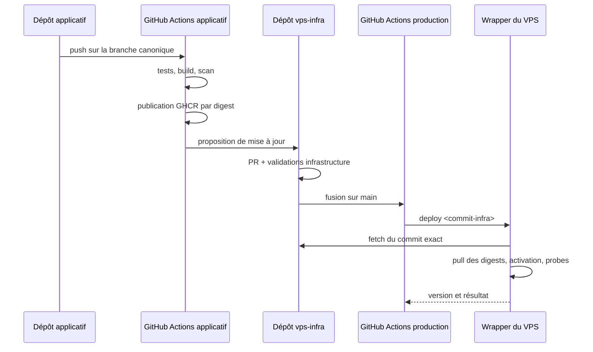
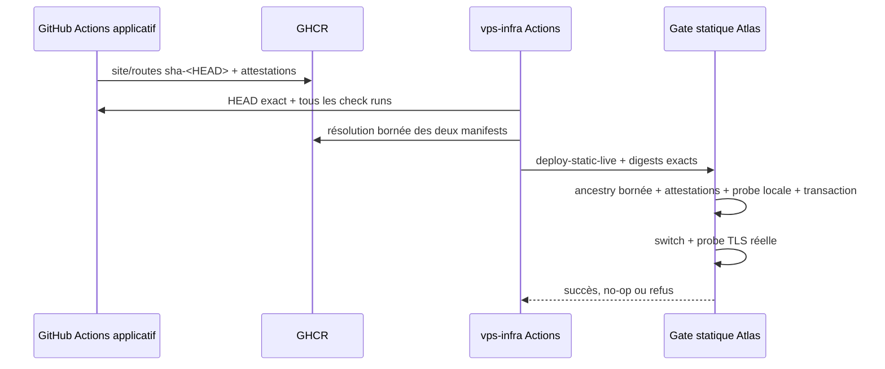

# Livrer et mettre à jour les projets

## Réponse courte

GitHub Actions builds, tests, and publishes immutable artifacts. For the three
static profiles, the central `vps-infra` scheduler automatically selects only
the current canonical producer HEAD after its checks and artifacts are ready.
No operator supplies an application SHA or digest to that workflow. Atlas then
revalidates the exact source and artifacts through a bounded controller.

Platform and Compose application promotion remain separate reviewed paths.
The canonical Surplasse tester admission entry is enabled. Parkventory and the
legacy Compose entries remain disabled. Atlas can fetch an explicit
infrastructure commit, but it never checks out an application branch and never
builds application source.

## Source de vérité : le manifeste de production

`releases/production.yaml` décrit l’état désiré et son validateur est
exécutable. L’extrait suivant illustre le contrat futur une fois les unités
activables ; il est volontairement refusé par la politique actuelle :

```yaml
schema: 1
activation_policy: locked

platform:
  enabled: true
  compose_project: vps-platform
  published_ports: [80/tcp, 443/tcp, 443/udp, 127.0.0.1:3000/tcp]
  blocked_by: []
  images:
    caddy: ghcr.io/nclsppr/vps-infra/caddy:2.11.4@sha256:<digest>
    postgres: ghcr.io/nclsppr/vps-infra/postgres:sha-<revision>@sha256:<digest>
    prometheus: docker.io/prom/prometheus:v3.13.2-busybox@sha256:<digest>
    grafana: docker.io/grafana/grafana:13.1.3-slim@sha256:<digest>
    node_exporter: docker.io/prom/node-exporter:v1.12.1-busybox@sha256:<digest>
    postgres_exporter: docker.io/prometheuscommunity/postgres-exporter:v0.20.1@sha256:<digest>
  integration:
    source_revision: <sha-config-plateforme>
    artifact: ghcr.io/nclsppr/vps-infra/platform-integration@sha256:<digest>
  postgres:
    major: 17
    pgdata: /var/lib/postgresql/data/pgdata
  readiness_evidence: <preuves-structurees>

applications:
  personal:
    enabled: true
    type: static
    source_repository: nclsppr/personal
    source_branch: main
    published_ports: []
    blocked_by: []
    source_revision: <sha-git-complet>
    artifact: ghcr.io/nclsppr/personal/site@sha256:<digest>
    route_inventory_artifact: ghcr.io/nclsppr/personal/routes@sha256:<digest>
    readiness_evidence: <preuves-structurees>

  papersempire:
    enabled: true
    type: static
    source_repository: nclsppr/papersempire
    source_branch: main
    published_ports: []
    blocked_by: []
    source_revision: <sha-git-complet>
    artifact: ghcr.io/nclsppr/papersempire/site@sha256:<digest>
    route_inventory_artifact: ghcr.io/nclsppr/papersempire/routes@sha256:<digest>
    readiness_evidence: <preuves-structurees>

  surplasse:
    enabled: true
    type: compose
    source_repository: nclsppr/surplasse
    source_branch: main
    compose_project: surplasse
    published_ports: []
    blocked_by: []
    components:
      backend:
        source_revision: <sha-backend>
        image: ghcr.io/nclsppr/surplasse/backend@sha256:<digest>
      onboarding:
        source_revision: <sha-onboarding>
        image: ghcr.io/nclsppr/surplasse/onboarding@sha256:<digest>
      commande:
        source_revision: <sha-commande>
        image: ghcr.io/nclsppr/surplasse/commande@sha256:<digest>
      dashboard:
        source_revision: <sha-dashboard>
        image: ghcr.io/nclsppr/surplasse/dashboard@sha256:<digest>
      docs:
        source_revision: <sha-docs>
        image: ghcr.io/nclsppr/surplasse/docs@sha256:<digest>
    integration:
      source_revision: <sha-contrat>
      artifact: ghcr.io/nclsppr/surplasse/vps-integration@sha256:<digest>
    migrations:
      strategy: dedicated
      runtime_auto_migrate: false
      proven: true
      evidence: <preuve-structuree>
    readiness_evidence: <preuves-structurees>

  parkventory:
    enabled: false
    type: compose
    source_repository: nclsppr/parkventory
    source_branch: main
    compose_project: parkventory
    published_ports: []
    blocked_by:
      - production-images
      - vps-integration-bundle
      - production-oidc-provider
      - postgres-adr-alignment
      - postgres-compatibility
      - separated-migrations
      - tenant-isolation-and-rls
      - restore-proof
      - domain-and-dns
      - production-secrets
      - file-based-secrets
      - prometheus-metrics
      - structured-logs
      - protected-main
      - public-smoke
```

`activation_policy: locked` est une barrière racine : tant qu’elle n’est pas
remplacée par une révision séparément auditée, **tout** `enabled: true` échoue,
même avec des champs de preuve syntaxiquement complets. Le manifeste commité
garde donc la plateforme et les quatre applications désactivées. Le marqueur
hôte et l’applicateur générique `apply-release` restent absents. Le rollout du
18 août 2026 a installé le contrôleur Compose séparé depuis la révision convergée
`da04a09bfa9788ae8127b63f9f3a6692bef2551b`. ADR-0013 active ensuite uniquement
l'admission canonique Surplasse testeurs. Parkventory reste refusé avant tout
accès réseau ou runtime. Aucun workflow de déploiement applicatif n'invoque le
gate root.

### Locked platform candidate declaration

The locked policy can record a complete candidate declaration before
activation. This declaration is not provenance-complete. The platform stays
disabled, publishes no port, and retains all current blockers. The four
candidate fields are an all-or-nothing group:

```yaml
platform:
  enabled: false
  compose_project: vps-platform
  published_ports: []
  blocked_by: [<all-current-platform-blockers>]
  images: <six-immutable-image-references>
  integration:
    source_revision: <full-vps-infra-commit>
    artifact: ghcr.io/nclsppr/vps-infra/platform-integration@sha256:<digest>
  postgres:
    major: 17
    pgdata: /var/lib/postgresql/data/pgdata
  readiness_evidence:
    caddy-ovh-image: <digest-bound-proof>
    immutable-image-digests: <same-digest-bound-proof>
```

The validator rejects a partial candidate. It also rejects a mutable reference,
an unexpected registry repository, a PostgreSQL major mismatch, and evidence
that is not bound to the integration revision. A locked candidate may declare
only the two gates the digest-bound workflow actually proves. Its `blocked_by`
array still contains all eight platform gates. Alert delivery, networks, DNS
credentials, runtime probes, secret permissions and PostgreSQL compatibility
cannot reuse that run as evidence. The controller requires the integration
revision to be an ancestor of the requested release commit. The online evidence
check runs before desired state is written. Reconciliation returns
`unchanged-disabled`, emits no applicable runtime reference, and still rejects
a quarantined candidate digest.

Candidate metadata is not an activation request. While
`activation_policy: locked` is the only accepted policy, the controller rejects
the production marker even if an applicator exists. It cannot create active
state.

The manual `.github/workflows/vps-release.yml` workflow certifies the exact
platform candidate subject for two review gates: `caddy-ovh-image` and
`immutable-image-digests`. It resolves and hashes all seven OCI references,
verifies supported labels, checks the Caddy OVH module, and verifies
workflow-bound GitHub attestations while rejecting self-hosted signers. The
custom PostgreSQL reference is restricted to
`ghcr.io/nclsppr/vps-infra/postgres`. Its label revision and readable tag must
match, and its provenance must come from `postgres-image.yml` on `main`.

Trivy writes JSON even when it finds a HIGH or CRITICAL vulnerability. The
proof engine then rejects every CRITICAL finding and every uncovered HIGH
finding. `policies/platform-vex-v1.json` is the only exception input. Its
versioned schema binds each `not_affected` statement to one service, full image
reference and digest, platform, target binary, package identity, installed
version, CVE, justification, and expiration date. The engine rejects an
expired, changed, duplicate, or unused exception. It uses no global ignore
file and no ignore flag.

The proof workflow source revision binds the VEX policy and evaluator. The VEX
policy is not runtime configuration, so the platform integration OCI artifact
does not contain it. The canonical platform proof v2 also records the exact VEX
file digest and the earliest expiry of its used statements. The evidence
verifier rechecks that UTC date. It rejects the proof after the date even if
GitHub still retains the artifact. The workflow writes a canonical raw proof
artifact.
`scripts/verify-github-evidence` reconstructs the same bytes and compares their
digest and run identity with public GitHub artifact metadata. This prevents the
reuse of a successful run after any candidate digest or run-attempt change.

This review proof removes no production blocker. The workflow requests 90-day
artifact retention, subject to the repository retention policy, and the
verifier rejects deleted or expired evidence. Keep `activation_policy: locked`
until durable provenance and every semantic gate have separate evidence.

The policy dated 2026-08-12 contains four temporary HIGH exceptions. Grafana
13.1.3-slim embeds Tempo code for CVE-2026-21728 and CVE-2026-28377, but Grafana
does not start the affected Tempo server path. These statements expire no later
than 2026-09-11. Independent `govulncheck` analysis of postgres_exporter 0.20.1
reports that its entry points do not call the vulnerable symbols for
CVE-2026-56852 and CVE-2026-39822. These statements expire no later than
2026-08-26. `govulncheck` also reports CVE-2026-42505 as separate information.
Trivy 0.73.0 does not report that CVE for the locked image, so the VEX policy
does not contain it. The proof will fail if a later Trivy database reports it.

### Platform integration publication

The `Platform integration artifact` workflow publishes the shared platform
configuration independently from activation. A push to `main` that changes a
runtime platform path, or a manual run on `main`, builds the package from the
exact workflow commit. The package contains an exact allowlist of Compose,
Caddy, PostgreSQL, Prometheus, and Grafana runtime files. It contains no Caddy
build source, documentation, inventory for a host, or secret.

The workflow publishes two layers in one OCI artifact: a deterministic
`tar.gz` archive and a canonical JSON inventory. It validates the remote
manifest digest, artifact type, layer media types, source annotation, revision
annotation, creation annotation, layer digests, layer sizes, layer titles, and
the bytes fetched back from GHCR. It creates provenance only after all these
checks pass. It then verifies the provenance against the exact workflow, full
source revision, `main` ref, and GitHub-hosted runner policy.

Publication does not update the production manifest. An operator must use the
resolved digest in a separate reviewed promotion. The locked activation policy
continues to reject service activation.

The schema stays at version 1 and still accepts the legacy manifest. An older
controller does not understand the candidate fields. Before a controller
downgrade, first use the current controller to record a legacy manifest that
omits all four candidate fields. Verify that `desired/manifest.json` contains
no candidate. Only then converge the older controller revision. Reverting the
controller first makes the old validator fail closed on the persisted
candidate.

Les tags lisibles peuvent être conservés comme annotations, mais Compose
consomme les digests. Une mise à jour est donc un diff Git relisible et un
rollback est d’abord un revert du manifeste.

Une application multi-images porte une révision par composant. Lorsqu’un
changement Backend ne reconstruit pas Dashboard, la révision et le digest
Dashboard restent ceux de son dernier build ; il serait faux de les attribuer
au nouveau commit global.

Le paquet `integration` est un artefact OCI déterministe et sans secret. Pour
Surplasse, il contient sous une allowlist stricte :

- le fragment Caddy ;
- les targets et règles Prometheus ;
- les dashboards et provisioning Grafana propres au projet ;
- l’inventaire des migrations ;
- le contrat de healthchecks et probes.

Avant activation, le contrôleur `deploy-application` tire ce digest dans un
répertoire jetable, vérifie les attestations, rejette tout chemin ou type de
fichier inattendu, puis matérialise exactement le bundle sous un répertoire de
release adressé par digest. Il ne modifie pas la release plateforme immuable :
le routage, les réseaux et l’observabilité doivent être préparés dans une
révision plateforme séparée avant que la migration applicative soit autorisée.

Pour Parkventory, `blocked_by` est un état temporaire, pas une preuve. Un futur
passage à `enabled: true` exigera les sections `components` et `integration`
sur le même modèle que Surplasse, puis une section `readiness_evidence`
couvrant exactement toutes les clés retirées : ADR du fournisseur OIDC et
tests de contrat, matrices PostgreSQL, tests négatifs runtime/RLS inter-tenant,
rapport de restauration,
paquet d’intégration, configuration domaine/DNS, références de secrets par
fichiers, métriques/logs, protection de branche et smoke public. La politique
locale lie chaque déclaration aux révisions connues ;
`scripts/verify-github-evidence` confirme séparément les métadonnées du run
public auprès de l’API GitHub. Cette première tranche ne prétend toutefois pas
encore prouver la protection de branche, l’attestation de chaque digest ni la
qualité sémantique du test : la barrière `activation_policy: locked` reste donc
obligatoire. Toute clé absente bloque déjà la validation structurelle.

## Chaîne de livraison



The three static sites use the narrower ADR-0008 path instead of editing the
dynamic production manifest. Their producer repositories keep every VPS secret
out of scope. The central `vps-infra` workflow is scheduled every ten minutes
on a best-effort basis and also accepts manual dispatch. It resolves the current
canonical SHA, waits for all observed checks to become complete and non-failing
and the configured expected checks to succeed, and resolves the matching site and
routes tags to digests. A red, incomplete, or newer unpublished HEAD preserves
the current Atlas release. The workflow never falls back to an older green SHA.

The resolver classifies each profile independently as `ready`, `pending`,
`blocked`, or `disabled`. Its job can succeed while only a subset enters the
deploy matrix. An overall green workflow is therefore not proof of a complete
three-site reconciliation. Require the resolver table, all expected deploy
jobs, matching Atlas protected state, empty transaction state, and strict public
probes. The
[operations runbook](operations/static-release-reconciliation.md) defines the
exact commands and the 2026-08-18 evidence is
[recorded separately](evidence/2026-08-18-static-reconciliation-rollout.md).



### 1. Workflow de chaque application

Il ne possède aucun secret VPS. Il :

1. vérifie le projet ;
2. builds the producer's declared release set; Surplasse currently rebuilds its
   fixed five-image matrix on every canonical `main` push ;
3. scanne les images de production ;
4. publie chaque image ou artefact sous le SHA qui l’a réellement produit ;
5. récupère le digest retourné par le registre ;
6. ajoute les labels OCI `source`, `revision` et `version` ;
7. publie SBOM, provenance et attestation lorsque le plan GitHub et la
   visibilité du dépôt le permettent ;
8. émet une demande de promotion vers `vps-infra`.

Static producers stop after publication and attestation. The central workflow
has no application, SHA, or digest input. A manual dispatch only asks the same
resolver to evaluate the current canonical heads. It cannot bypass checks or
select an older candidate. A future Compose promotion request, if added, must
use a separately reviewed least-privilege cross-repository contract.

The shared Caddy image has an additional fail-closed gate. A pull request builds
native `linux/amd64` and `linux/arm64` images from the committed Go graph. It
verifies the OVH module and Caddy configuration, then rejects every HIGH or
CRITICAL finding with the digest-pinned Trivy scanner. A `main` build can push
an image before the remote scan, but it cannot attest or propose that image for
promotion until both exact child manifest digests pass the same policy. The
workflow then verifies OCI source and revision labels and GitHub provenance.
There is no initial vulnerability ignore list.

Le futur workflow de promotion d’infrastructure ne devra jamais faire confiance
au seul payload reçu. Avant déverrouillage, il devra vérifier :

- que chaque révision de composant ou d’intégration existe dans le dépôt attendu
  et appartient à la branche `main` déclarée dans le manifeste ;
- que chaque digest existe dans le namespace attendu ;
- que le label de révision de chaque digest correspond à sa propre révision ;
- que l’attestation est valide lorsqu’elle est disponible ;
- que la demande ne modifie que la section autorisée du manifeste.

### 2. Pull request de promotion

La PR montre exactement :

- l’ancienne et la nouvelle révision de chaque composant modifié ;
- les anciens et nouveaux digests ;
- les composants réellement modifiés ;
- le diff rendu des routes, règles, dashboards et probes si le paquet
  d’intégration change ;
- les migrations détectées ;
- les probes prévues ;
- la commande de rollback.

Les validations obligatoires du dépôt VPS :

- schéma et cohérence du manifeste ;
- `docker compose config --quiet` pour la plateforme et chaque application ;
- interdiction des tags non accompagnés d’un digest ;
- interdiction des ports hôte hors allowlist ;
- validation Caddy ;
- `promtool check config` et `promtool check rules` ;
- syntaxe et lint Ansible ;
- absence de secret en clair ;
- correspondance images, dépôts et révisions ;
- preuves de readiness obligatoires pour toute activation Parkventory.

Le dépôt `vps-infra` doit avoir une protection de branche ou un ruleset externe
exigeant ces contrôles. Une simple convention dans le dépôt ne protège pas
contre une modification simultanée du workflow et de ses garde-fous.
Les branches canoniques de Personal et Papers Empire doivent elles aussi être
protégées avant que leurs builds puissent promouvoir automatiquement une
production.

### 3. Workflow de production

Seul le dépôt VPS possède l’environnement GitHub `production` et son secret SSH.
Le job :

- ne s’exécute que pour un commit de `main` ;
- utilise `environment: production` et, si disponible, une approbation requise ;
- utilise une concurrence globale `production-vps` avec
  `cancel-in-progress: false` ;
- épingle les GitHub Actions tierces à leur SHA complet ;
- vérifie l’empreinte SSH connue, sans `ssh-keyscan` opportuniste ;
- envoie uniquement `deploy <sha-infra-complet>` au serveur.

The static reconciler uses the same global concurrency group but a separate
`static-production` environment and environment variable
`VPS_STATIC_DEPLOY_ENABLED`. Its deploy matrix is serialized so only one static
candidate reaches the Atlas static lock at a time. The environment owns one
dedicated key and the same strict known-hosts model. It sends only the canonical
`deploy-static-live` command. Enabling this path does not set
`VPS_DEPLOY_ENABLED`, create `/etc/vps/production-enabled`, or install
`apply-release`. The repository application controller is designed to share
the exact host lock `/run/lock/vps-static.lock` with this path; GitHub
concurrency alone is not a sufficient exclusion boundary for operator-initiated
commands. The 2026-08-18 rollout converged the controller and argument-free gate
from revision `da04a09bfa9788ae8127b63f9f3a6692bef2551b`. Canonical Surplasse
admission is now enabled. The Parkventory application workflow is manual and
resolves no deployment matrix while Parkventory remains disabled. Future
dispatch also needs the independent protected-environment activation switch.

Le VPS n’héberge pas de runner GitHub Actions persistant. Un workflow arbitraire
exécuté directement sur la machine de production aurait accès à ses volumes,
conteneurs et secrets et pourrait laisser un runner compromis.

### 4. Point d’entrée borné sur le VPS

Le compte SSH de livraison :

- possède un shell système valide, mais aucun shell **interactif** autorisé ;
- n’est pas membre du groupe `docker` ;
- porte une clé distincte de la clé administrateur ;
- utilise une entrée `authorized_keys` avec `restrict`, une commande forcée et
  un parseur acceptant uniquement le contrat documenté ;
- peut appeler uniquement un script root-owned via une règle `sudoers`
  explicite, avec chemins absolus et sans `SETENV`.

The delivered `deploy` script accepts only a full Git commit ID. It:

1. acquires one atomic global lock;
2. verifies the exact public HTTPS origin and fetches only `main`;
3. verifies that the requested commit is reachable from `origin/main`;
4. reads the manifest from that Git object and validates it;
5. verifies that the platform integration revision is an ancestor of the
   requested release commit;
6. verifies declared GitHub evidence before it writes desired state;
7. rejects quarantined digests and writes a non-mutating reconciliation plan;
8. records desired state only after all previous checks succeed;
9. rejects `/etc/vps/production-enabled` while `activation_policy` is locked.

The generic locked controller still does not contain an applicator execution
path. A separate repository-delivered `deploy-application` controller defines
immutable digest pulls, configuration rendering, dedicated migrations,
targeted Compose activation, probes, compatible runtime rollback, and durable
journaling. Ansible installed it and its root gate on Atlas from revision
`da04a09bfa9788ae8127b63f9f3a6692bef2551b`. Its recovery service is loaded and
was inactive after a successful run (`Result=success`, `ExecMainStatus=0`) on
2026-08-18. It re-reads the protected application contract first, so the
production marker or the presence of the executable cannot enable a disabled
application.

Les projets Compose ont des noms fixes (`vps-platform`, `surplasse` et
`parkventory`) afin qu’un nouveau chemin de checkout ne crée pas de nouveaux
volumes ou réseaux. Un pointeur `/srv/vps/current` désigne le commit actif, mais
les services montent leurs fichiers depuis des répertoires runtime stables sous
`/srv/vps/runtime/config/`. Après validation, le wrapper synchronise
atomiquement ces répertoires, recrée ou recharge les seuls consommateurs puis
bascule `current`. La procédure inverse restaure les fichiers rendus précédents.

La clé GHCR présente sur le VPS est en lecture seule. Le dépôt public
`vps-infra` est lu en HTTPS sans credential Git. S’il devient privé, une deploy
key Git distincte sera régénérée et enregistrée lors d’une reconstruction. Les
secrets applicatifs sont déjà matérialisés sous `/etc/vps/secrets` ; un
déploiement de code courant ne les transporte pas depuis GitHub Actions.

## Déployer un site statique

Personal, Papers Empire, and the Parkventory demo publish complete archives as
OCI artifacts in GHCR. The producer workflows use ORAS to publish and attest
these artifacts.
The VPS materializer downloads the site, route, and integration manifests and
payloads through HTTPS with transfer limits and digest references. The common
contract defines media types, deterministic archives, source SHA annotations,
checksums, maximum sizes, maximum file counts, and the prohibition of links and
special files.

### Personal

Le workflow construit un répertoire `site/` par allowlist. Il inclut seulement
les pages HTML, erreurs, assets, favicons, manifest, robots, sitemap et fichiers
publics voulus. Il exclut notamment :

- `.git`, `.github` et `.claude` ;
- `AGENTS.md`, `README.md` et `CHANGELOG.md` ;
- `infos/` et toute source éditoriale interne ;
- scripts de génération et fichiers temporaires.

Before publication, the allowlist generates one inventory entry for every
regular file. The producer workflow does not start an HTTP server. The VPS
materializer probes each resulting file route through temporary Caddy.
Host-based redirects are not file routes. The temporary probe verifies only the
redirects carried by the exact platform integration pinned in
`releases/static-production.json`; it must not assume routes from a newer
checkout. The live public edge separately verifies `www.nicolaspieper.com`,
`pieper.fr`, `www.pieper.fr`, and `nicolas.pieper.fr`. Each live alias must
return one permanent redirect to `https://nicolaspieper.com` while preserving
the request path and query. The live probe also requires the complete redirect
security-header set without HSTS. This matches the public-edge redirect block
and preserves rollback for the `.fr` aliases. Canonical Personal responses
still require HSTS.

### Papers Empire

Le workflow conserve sa vraie construction :

1. installation verrouillée des dépendances ;
2. build Retype vers `docs-site/` ;
3. assemblage de `site/` ;
4. génération des pages `/en/`, `/de/` et `/lb/` ;
5. cache-busting par SHA ;
6. route inventory generation for the complete assembled tree.

The producer workflow does not perform an HTTP smoke. The VPS materializer
provides the first Caddy HTTPS proof for every inventory route.

L’archive contient exactement le même `site/` que l’artefact Pages, pas la
racine du dépôt. `papersempire.com` reste l’apex canonique ; aucune redirection
vers `www` ne doit changer l’origine de son `localStorage`.

### Parkventory demo

The Parkventory workflow runs the frontend tests and builds the explicit demo
at the root path. It does not build or publish the development backend. It
creates deterministic site and route artifacts with direct entries for `/`,
`/app/`, `/app/partager/`, `/app/trouver/`, and `/auth/callback/`.

The Atlas route serves only `/srv/www/parkventory/current`. It contains no
`reverse_proxy`, API handler, application port, secret, or database access. The
production Compose application remains disabled until its separate readiness
gates pass.

The static contract labels this release `temporary-static-demo`. Parkventory's
future production shape is a React frontend image plus a Java backend image,
with a dedicated migrator and integration bundle. The static resolver and the
Atlas gate reject a state where both the demo promotion and the Compose
application are enabled or where an active dynamic manifest still serves it.
The repository application applicator enforces the inverse guard against an
existing static state after it is converged. A later reviewed cutover must transfer the
`parkventory.com` route under one shared deployment lock.

### Activation

Ansible installs checksum-verified GitHub CLI 2.97.0. ORAS remains a locked
local and CI publishing tool; it is not part of the Atlas runtime.
The operator-facing deployment form of `deploy-static` accepts seven bounded
arguments:

```text
deploy-static <personal|papersempire|parkventory> <source-sha40> \
  <site-ref@sha256> <routes-ref@sha256> \
  <integration-sha40> <integration-ref@sha256> \
  <caddy-image@sha256>
```

Without `--activate-live`, this form only materializes and probes the immutable
release; it never changes `current`. Live mutation is reserved for the
root-owned automated gate.

Internal worker forms are generated by the root orchestrator. They receive
fixed bounded contracts and are not operator interfaces.

The automated boundary accepts only the corresponding canonical record:

```text
deploy-static-live <application> <source-sha40> <site@sha256> <routes@sha256> \
  <integration-sha40> <integration@sha256> <caddy@sha256>
```

The unprivileged forced command validates it first. A root-owned, no-argument
gate receives one bounded ASCII line on stdin and validates the complete
allowlist again before it starts `deploy-static --activate-live` in a transient
systemd unit. The unit survives the SSH client and runs `--recover-live` from
its stop hook. This design does not depend on sudoers argument regex support,
which Atlas `sudo-rs` does not provide.

The Compose application boundary uses the parallel canonical record:

```text
deploy-application-live <surplasse|parkventory|monflorian> <source-sha40> \
  <application-release@sha256>
```

Its argument-free root gate independently revalidates stdin and starts
`deploy-application --activate-live` in a transient systemd unit with an
automatic recovery stop hook. The controller verifies the application release,
all component image attestations and labels, the integration attestation and
bundle bytes, rendered Compose, root-owned secret metadata, exact migration and
probe inventories, source ancestry, and the canonical source HEAD. It never
stores secret bytes. It refuses migration until the immutable public-edge route
equals the attested route and Caddy is healthy on the exact application network.
Canonical Surplasse tester admission is enabled, but no application workflow
currently invokes this boundary for Surplasse. Parkventory's manual workflow
resolves no deployment matrix while its admission entry remains disabled, so it
stops before runtime validation or network access. Mon Florian also remains
disabled; it admits one backend, one `app_monflorian` network, migration
strategy `none`, and one file-backed OpenAI key contract. Surplasse still
requires the explicit forced command and every runtime gate above.

For Surplasse, the immutable integration contract contains the exact tester
payment profile. Materialization and the first activation preflight both bind
that object to the versioned Atlas adapter, rendered
`STRIPE_LIVE_MODE=false`, and protected operator manifest version `3` with
`payment_mode=test` and the exact input digest set. A mismatch stops before
`prepare_transaction`, image pulls, migration, or container start. The legacy
adapter validator alone is not canonical activation evidence. A later live
profile requires one separate atomic application, Atlas key, webhook, and
service-recreation change.

The application profile fixes the site repository, route repository, source
repository, source ref, and signer workflow. The integration repository,
`vps-infra` source repository, `refs/heads/main` source ref, and platform
integration workflow are also fixed. The Caddy image must equal the protected
`CADDY_PLATFORM_IMAGE` value in the infrastructure mirror and the value in the
exact integration package.

Before payload download, the materializer verifies separate GitHub artifact
attestations for the site manifest, route manifest, and integration manifest.
Each check binds the subject to its exact repository, full revision, source ref,
and workflow. Each check rejects a self-hosted signer. One separate
network-enabled systemd `DynamicUser` execution uses the checksum-pinned GitHub
CLI and its embedded TUF bootstrap roots to obtain one current trusted-root
snapshot for the deployment. The root orchestrator validates its structure and
versioned SHA-256 before it copies the snapshot and removes the fetch state. A
root rotation fails closed until a reviewed repository update changes the
accepted digest. Other network-enabled executions
download the attestation indexes, manifests, and bundles with explicit transfer
limits. The root orchestrator copies each exact bundle set and removes its fetch
state. A separate sequential offline execution of the same fixed transient unit
gives the bundle, trusted root, and digest-bound local OCI manifest to GitHub CLI
with `--bundle` and `--custom-trusted-root`. The fixed unit name prevents
concurrent worker creation. GitHub CLI receives no operator credential.

This provenance check does not prove branch protection. Protect the canonical
branches of `vps-infra`, Personal, Papers Empire, and Parkventory with
repository rulesets as a separate gate. Do not replace this control with an
attested source ref. Atlas additionally runs the Git ancestry proof in a
network-enabled `DynamicUser` unit with runtime, memory, swap, per-file, tmpfs,
and host-network limits; it rejects a candidate that is not a descendant of the
managed active revision.

Every registry token response, OCI manifest, payload layer, and attestation
object has an explicit maximum size. Bounded readers also limit each untrusted
manifest, inventory, package, and attestation input. These registry and
attestation transfers run in short-lived systemd `DynamicUser` executions and
fail at their bounds. The bearer header stays in a private worker file.
Manifest and payload copies are checked against caller-known digests. Payload
copies also use exact sizes from reconstructed manifests. The copied
attestation bundle set is size-bounded before the offline signature verifier
authenticates it. The trusted-root execution has runtime, memory, per-file size,
inode, and tmpfs limits. GitHub CLI does not expose an in-transfer size limit for
its internal TUF client. Manifest, gzip, tar, inventory, integration package,
and attestation parsing also runs in bounded `DynamicUser` executions. Their
private runtime directories use a dedicated tmpfs. The orchestrator waits for
the complete cgroup to exit before it consumes a result. The temporary Caddy
image pull remains a separate root-controlled Docker operation by immutable
digest. The VPS does not use a build tool or an application checkout.

The integration manifest identifies an exact deterministic archive and
canonical inventory. The unprivileged integration worker verifies and extracts
both layers. The package must contain the base Caddyfile and the exact
`<application>.caddy.disabled` path for the requested application. It must not
contain the corresponding active route. The probe copies that candidate into a
temporary tree as `<application>.caddy`. It does not change the integration
package or the locked platform configuration.

The pre-activation probe uses the exact platform Caddy image by digest. It first
runs `caddy validate` with the exact packaged Caddyfile and temporary route set.
It then adds `local_certs` exactly once to a separate temporary Caddyfile and
starts HTTPS on a loopback-only random port. The probe uses the canonical host,
requests every inventory route, and compares each response checksum. It also
checks the 404 response, security headers, the `no-cache` HTML policy, the
`public, max-age=3600` asset policy, gzip for a payload larger than 1 KiB, and
configured host redirects. The main Caddy would still serve `current`, so it
cannot provide this proof.

Before the probe, the materializer makes the release root-owned. It fsyncs each
file and then each directory from the deepest directory to the release root.
After a successful probe, it fsyncs the releases directory before and after the
final digest-named rename. The final directory name contains the site OCI
manifest digest, not the source SHA or the archive layer digest.

The `current` activation uses protected directory file descriptors,
`O_NOFOLLOW`, and one exact relative release target. The materializer fsyncs the
application directory before and after the atomic symlink replacement. If the
post-replacement fsync fails, it restores the previous target and fsyncs that
rollback. It reports an explicit error if it cannot make the rollback durable.

The local `local_certs` probe remains a pre-activation proof. The live form then
records a durable transaction, switches `current`, and probes the running edge
on loopback port 443 with normal certificate-chain and hostname validation. It
rechecks every inventory body, the 404 page, cache and security headers, gzip,
and the redirects in the real public edge contract. Only success writes the
complete active tuple and protected route inventory. Failure records a neutral
rejection phase and durably restores the previous symlink before it rechecks
the source HEAD and exact Caddy identity. It writes the exact tuple under
`/var/lib/vps-static/quarantine` only when those prerequisites are unchanged;
an interruption before classification causes conservative quarantine, while a
durable `superseded` phase remains retryable. Interruption is recovered before another
candidate, from the transient unit stop hook, and at boot before the
systemd-managed public edge. Docker may still restart the existing
`unless-stopped` Caddy container before that systemd ordering; this remaining
daemon-level traffic bypass is not a recovery guarantee. Recovery validates
each managed target against its protected inventory
and removes only bounded labeled probe containers and strictly named staging
residue. An exact active tuple uses that protected inventory to validate the local
release plus a bounded live TLS sample without downloading GHCR again. The
generic production policy stays locked and `apply-release` remains absent.

## Deploy the public static edge

The static edge has a separate bounded deployment mode because static sites do
not depend on the database or observability images:

First run normal host convergence at the same approved `main` revision. It
creates the managed external `edge` bridge on `172.30.32.0/24`. The static edge
playbook refuses a missing or incompatible bridge. Its exact Compose contract
joins Caddy only to `edge` and rejects an attachment to the internal `ops`
network.

```bash
make prepare-public-static-edge \
  ANSIBLE_EXTRA_VARS=/absolute/path/to/bootstrap-public.yml
```

The command archives the exact `origin/main` commit into an isolated directory.
It then stages an immutable Caddy-only release with the validator from the same
commit, validates it without network access, switches one runtime symlink
atomically, and starts exactly Caddy. Its preparation routes are explicitly
HTTP-only so certificate issuance does not start while DNS still points to
GitHub Pages.

Capture the complete DNS records first. For all three zones, change the apex
and `www` A records to the single Atlas IPv4 address. Explicitly delete every old
GitHub Pages AAAA record at the apex and `www`; merely avoiding a new Atlas
AAAA record is insufficient. Do not change MX, TXT, CAA, or mail-related
records. Verify the answers directly against every authoritative nameserver.
Then activate HTTPS:

```bash
make activate-public-static-edge \
  ANSIBLE_EXTRA_VARS=/absolute/path/to/bootstrap-public.yml
```

The activation refuses to start while an authoritative or recursive A answer
differs from Atlas or while any AAAA answer remains. It atomically switches to
the HTTPS routes, waits for certificate issuance, and requires strict HTTPS
responses for all three apexes and all three `www` redirects. The bounded
rollback is:

```bash
make stop-public-static-edge \
  ANSIBLE_EXTRA_VARS=/absolute/path/to/bootstrap-public.yml
```

Stopping the edge preserves all three static release trees and the ACME volumes.
DNS rollback restores the exact records captured before the cutover.

### Add the `pieper.fr` aliases to an already active edge

Do not run the HTTP-only preparation mode over the active HTTPS edge. First
export the complete current `pieper.fr` zone. Lower only the TTL of the three
web names `pieper.fr`, `www.pieper.fr`, and `nicolas.pieper.fr`; do not change
their targets, MX, TXT, DNSSEC, or any other record. Wait at least the previous
web TTL, measured from the point at which every authoritative server returns the
lower TTL. A lower TTL published now does not expire answers already cached with
the previous value.

After that wait, install the safe pre-cutover release:

```bash
make precutover-public-static-edge \
  ANSIBLE_EXTRA_VARS=/absolute/path/to/bootstrap-public.yml
```

This atomic switch preserves the three established HTTPS apexes and their
existing `www` redirects. It adds only HTTP `308` routes for the three pending
`.fr` aliases and probes those routes directly on the Atlas IPv4 address, so it
neither depends on the old DNS answers nor asks ACME for the pending names.

Change only the three web A answers to the Atlas IPv4 address and remove their
old AAAA answers. Once every authoritative server and the recursive probes show
the exact target, immediately run `make activate-public-static-edge`. The
activation atomically replaces the pre-cutover routes with the full HTTPS
redirect set. Caddy then requests the three alias certificates, so a short HTTPS
issuance interval follows the switch; HTTP continues to redirect during that
interval. None of the aliases currently provides a functional HTTPS redirect,
but the three established sites must remain available throughout.

If activation or its strict certificate probes fail, the Ansible rescue restores
the previous pre-cutover release and restarts it. Restore the three exact web
records from the DNS export; do not stop the shared edge and do not modify mail
or DNSSEC records. Re-run the established HTTPS probes and the direct-Atlas HTTP
alias probes before a new attempt. The alias redirect blocks intentionally emit
no HSTS, including after full activation, so a failed cutover cannot pin browsers
to Atlas during the rollback TTL window. This does not remove HSTS from the
established canonical sites.

This deployment does not waive or cancel the internal platform. PostgreSQL and
Grafana are still required for Surplasse and Parkventory. They are admitted and
started in a separate unit so their private image risk cannot block a clean
public Caddy image and non-executable static content.

## Start the internal platform

The internal controller starts exactly PostgreSQL, Prometheus, Grafana, Node
Exporter, and PostgreSQL Exporter. It never starts or stops Caddy. It validates
all six image references from `platform/expected-images.json`, but it pulls
only the five selected internal service images. It also refuses a pre-existing
unselected container in the `vps-platform` Compose project before
`--remove-orphans` can change that project.

Run host convergence first. Then start the internal unit from the immutable
`origin/main` snapshot:

```bash
make start-internal-platform \
  ANSIBLE_EXTRA_VARS=/absolute/path/to/bootstrap-public.yml
```

The controller creates four random file-based secrets when they do not exist.
It keeps PostgreSQL files at `root:70 0440` and Grafana files at
`root:472 0440`. An existing value is never replaced. A symlink, hard link,
unexpected mode, owner, length, or character set stops the deployment.

The release directory is immutable and a root-owned symlink switches it
atomically. Failed systemd reconciliation or a failed functional probe restores
the previous release and reconciles the same five-service set. The rollback
does not use `docker compose down`, remove a named volume, or delete a secret.

The success proof requires all five containers to use their expected registry
digests and expected networks. It also requires PostgreSQL 17 with data
checksums, the exporter role membership, live exporter metrics, exactly three
healthy Prometheus scrape targets, and a healthy Grafana database response.
Grafana binds only `127.0.0.1:3000`. PostgreSQL and all metrics endpoints bind
no host port.

The bounded stop operation preserves the three named data volumes and all four
secrets:

```bash
make stop-internal-platform \
  ANSIBLE_EXTRA_VARS=/absolute/path/to/bootstrap-public.yml
```

After the internal platform is healthy, install the daily local PostgreSQL
backup and monthly isolated restore rehearsal. For the first Surplasse tester
activation, one immediate backup and rehearsal are strongly recommended, but
their absence is an explicitly accepted, non-blocking risk. They are mandatory
before the real public launch and before any later schema-changing migration.
The local stage is explicitly not encrypted and not off-site. Follow
[`operations/postgresql-backup.md`](operations/postgresql-backup.md) for the
commands, guarantees, and remaining disaster-recovery decision.

## Deploy a Compose application

The canonical Surplasse entry is `enabled: true`; Parkventory and Mon Florian
remain disabled.
Admission does not invoke the gate, and no live application release follows from
this repository change alone. The Parkventory-only manual workflow is inert in
that state and retains a separate protected-environment activation switch. A
deliberate Surplasse activation must keep this order:

1. render non-secret configuration from the immutable release;
2. verify every root-owned secret file and exact service allocation;
3. pull and attest the exact image and integration digests;
4. prove the database, resource, and migration-compatibility prerequisites, and
   record the strongly recommended local backup and restore evidence or its
   accepted absence for this first tester activation;
5. prepare the immutable public-edge route and attach healthy Caddy to the exact
   application network;
6. require that the installed route equals the attested route before any
   application schema migration;
7. run the dedicated one-shot migration with the migrator role;
8. start only the application Compose project and wait for health;
9. run internal probes and strict public TLS probes resolved directly to Atlas;
10. persist active state only after the complete transaction is `probed`.

Parkventory has stricter public-beta prerequisites than the retained Surplasse
tester exception. [ADR-0015](decisions/0015-parkventory-public-beta-readiness.md)
and the [Parkventory PostgreSQL runbook](operations/parkventory-postgresql.md)
require exact non-`BYPASSRLS` roles, both digest-bound readiness files, a fresh
encrypted receipt and matching off-Atlas restore rehearsal, OIDC and SMTP
credentials, active scraping and delivered alerts, structured logs, and the
explicit static-to-Compose ownership handoff before this order can start.

The application controller does not rewrite the platform edge. Route and
network preparation is a separate reviewed platform cutover and must precede
migration.

Compose recrée seulement les services dont l’image ou la configuration a
changé. Les digests Surplasse restent indépendants, mais son workflow publie
actuellement les cinq images pour chaque push canonique et les lie toutes au
même SHA. Une future sélection des composants affectés devra préserver le même
descripteur atomique et ne constitue pas une condition d’activation actuelle.

Le déploiement ne lance jamais :

- `docker compose down --volumes` ;
- un build local ;
- un `prune -af` non borné ;
- le Compose plateforme pour une simple mise à jour applicative.

## Migrations PostgreSQL

Les deux backends exécutent actuellement Flyway au démarrage avec le compte
applicatif. Leur activation sur la plateforme partagée exige de séparer :

- un rôle propriétaire sans login ;
- un rôle migrateur utilisé par une étape unique et autorisé à `SET ROLE` vers
  l’owner ;
- un rôle runtime restreint.

Le runtime fixe `migrate-at-start=false`, n’a aucun DDL et consomme ses secrets
par fichier. `ALTER DEFAULT PRIVILEGES` garantit ses droits DML sur les futurs
objets. Une gate négative prouve que le runtime ne peut ni créer une table, ni
modifier un schéma, ni se connecter à la base de l’autre projet.

Pendant une livraison :

- un seul déploiement applicatif peut migrer à la fois ;
- le wrapper détecte la présence de nouvelles migrations ;
- pour la première activation testeurs, la sauvegarde locale et la répétition
  de restauration sont fortement recommandées, mais leur absence est un risque
  accepté et non bloquant ;
- avant l’ouverture publique réelle ou toute migration ultérieure, une
  sauvegarde exploitable et une répétition de restauration réussie sont
  exigées ;
- les migrations incompatibles utilisent une stratégie expand/contract ;
- une migration déjà appliquée n’est jamais « annulée » automatiquement.

Le rollback d’image ne constitue donc pas un rollback de schéma. L’ancienne
image doit rester compatible avec le schéma étendu, ou la correction se fait
vers l’avant.

## Retour arrière

### Statique

Create and merge a producer revert as a new descendant commit. Let the normal
checks publish the matching immutable artifacts, then let the same reconciler
deploy and probe that new revision. Do not force-push, request an old SHA, move
an OCI tag, or manually repoint `current`. The ancestry check intentionally
rejects a history rollback. Follow the
[static reconciliation runbook](operations/static-release-reconciliation.md).

### Application

Use a reviewed release change and the same pipeline. A prepared-only failure can
restore the previous runtime without a schema transition. The first Surplasse
tester activation has no previous application runtime, so ADR-0013 accepts this
bounded initial case. After that activation, do not deploy a schema-changing
release until an attested invariant proves that the previous runtime is
compatible, or until recovery stops for explicit forward repair. Git remains
desired state and must receive a revert or corrective change before another
reconciliation.

### Plateforme

Les mises à jour Caddy, Prometheus et Grafana suivent une PR dédiée et un
déploiement ciblé. PostgreSQL suit un runbook de maintenance séparé avec preuve
de sauvegarde, répétition de restauration et fenêtre planifiée. Une version
majeure n’est jamais rétrogradée en remettant simplement l’ancien digest.

## Pourquoi ne pas faire seulement un pull périodique ?

| Modèle | Avantage | Risque | Décision |
|---|---|---|---|
| Action GitHub → commande SSH bornée → pull exact sur le VPS | immédiat, historique de déploiement et environnement protégé | secret SSH dans une seule racine de confiance | **recommandé initialement** |
| Timer systemd qui sonde `vps-infra/main` | seulement du trafic sortant | polling, attribution GitHub moins claire, mauvaise fusion déployée immédiatement | option future exclusive |
| `git pull` par dépôt puis build | simple en apparence | mutable, outils de build en prod, quatre clés et rollback faible | rejeté |
| runner GitHub persistant sur le VPS | connexion sortante | exécution de workflows directement dans la zone de confiance | rejeté |

Le modèle pull par timer peut devenir pertinent si l’on veut supprimer tout
déclenchement SSH automatisé. Il devra alors vérifier des commits signés ou une
release approuvée, utiliser le même wrapper et remplacer — jamais doubler — le
déclencheur GitHub Actions. Deux contrôleurs concurrents ne doivent pas déployer
le même VPS.

## Surplasse database preparation

`make prepare-surplasse` is a bounded production operation. It validates and
stages the exact locked adapter before it changes database state. It creates
only the missing database passwords. It uses the healthy shared PostgreSQL
container through its durable `db_surplasse` membership. Against an older
platform revision only, the preparation role creates and then removes a
temporary connection.

The transaction creates one database owner with `NOLOGIN`, one migrator login,
and one runtime login. The runtime role cannot create schema objects. No
service publishes port 5432. This operation does not start Surplasse, modify
Caddy or Prometheus, consume OVH credentials, or change DNS.

`make activate-surplasse` remains a fail-closed legacy-adapter command. The
canonical producer publishes an immutable application release and common
integration bundle, and ADR-0013 enables only the canonical admission path. The
legacy adapter does not become an activation path. The operator must prepare
the exact route and network before the one-shot migration and must satisfy the
existing secret, SMTP, Stripe test, recovery, internal probe, and public HTTPS
checks.

## Remaining changes by repository

### `personal`

The allowlisted site build, route inventory, immutable OCI publication,
attestation, and Atlas deployment are complete. Keep the producer branch
protection on its PR gate `Validate VPS release`. Separately, keep the
canonical-push job names consumed by the central resolver aligned with
`releases/static-production.json`; those are not branch-protection check names.

### `papersempire`

The assembled `site/`, route inventory, immutable OCI publication, attestation,
and Atlas deployment are complete. Keep `main` protected and preserve the
canonical `papersempire.com` origin for browser state.

### `parkventory`

Static publication and deployment are complete. The repository also publishes
immutable Backend, Frontend, integration, and application-release artifacts.
Keep the Compose contract disabled while OIDC, cookies, SMTP, PostgreSQL,
migration compatibility, RLS isolation, restore, secrets, metrics, logs,
resource budgets, retention, route handoff, recovery, branch protection, and
public probes remain unproved.

### `surplasse`

The canonical producer publishes independently pinned components, the common
integration bundle, and one immutable application-release descriptor. Canonical
tester admission is enabled, but the legacy adapter stays locked and admission
is not live activation. Before the deliberate operator activation, prove the
database and roles, secrets, SMTP, observability, edge route and network
attachment, migration, resource budgets, boot recovery, and strict public
probes.
