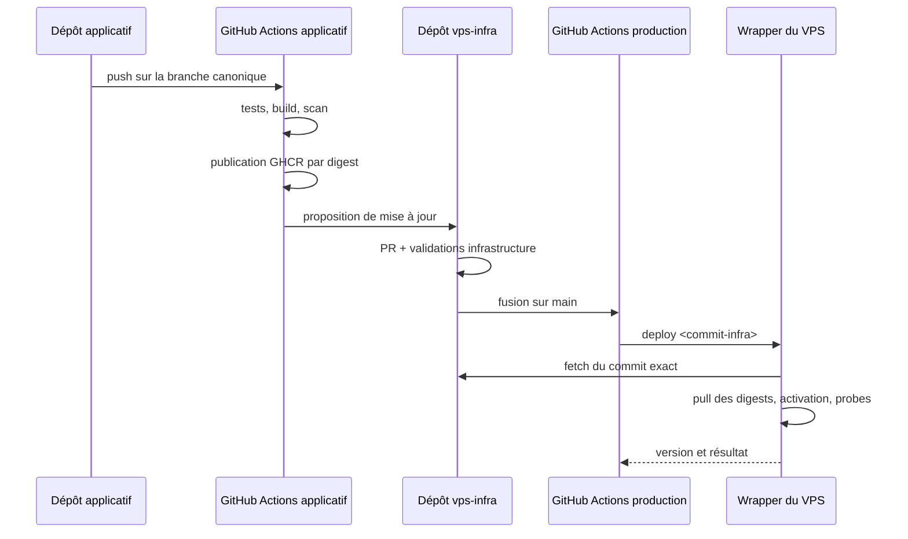

# Livrer et mettre à jour les projets

## Réponse courte

La bonne séparation n’est pas « GitHub Actions **ou** pull depuis le VPS » :

- **GitHub Actions construit, teste et publie** les artefacts ;
- une pull request dans `vps-infra` choisit les digests à promouvoir ;
- après fusion, **un déclenchement manuel contrôlé du workflow `vps-infra`
  demande d’abord le déploiement** ;
- le VPS **tire le commit d’infrastructure et les artefacts exacts**, puis
  exécute un wrapper borné.

Le serveur peut donc faire un `git fetch`, mais uniquement pour récupérer un
commit explicite du dépôt d’infrastructure. Il ne tire jamais les branches des
applications et ne compile jamais leurs sources.

## Source de vérité : le manifeste de production

`releases/production.yaml` décrit l’état désiré et son validateur est
exécutable. L’extrait suivant illustre le contrat futur une fois les unités
activables ; il est volontairement refusé par la politique actuelle :

```yaml
schema: 1
activation_policy: locked

platform:
  enabled: true
  compose_project: vps-platform
  published_ports: [80/tcp, 443/tcp, 443/udp, 127.0.0.1:3000/tcp]
  blocked_by: []
  images:
    caddy: ghcr.io/nclsppr/vps-infra/caddy:2.11.4@sha256:<digest>
    postgres: docker.io/library/postgres:17.10-bookworm@sha256:<digest>
    prometheus: docker.io/prom/prometheus:v3.13.1@sha256:<digest>
    grafana: docker.io/grafana/grafana:13.1.1@sha256:<digest>
    node_exporter: docker.io/prom/node-exporter:<version>@sha256:<digest>
    postgres_exporter: docker.io/prometheuscommunity/postgres-exporter:<version>@sha256:<digest>
  integration:
    source_revision: <sha-config-plateforme>
    artifact: ghcr.io/nclsppr/vps-infra/platform-integration@sha256:<digest>
  postgres:
    major: 17
    pgdata: /var/lib/postgresql/data/pgdata
  readiness_evidence: <preuves-structurees>

applications:
  personal:
    enabled: true
    type: static
    source_repository: nclsppr/personal
    source_branch: main
    published_ports: []
    blocked_by: []
    source_revision: <sha-git-complet>
    artifact: ghcr.io/nclsppr/personal/site@sha256:<digest>
    route_inventory_artifact: ghcr.io/nclsppr/personal/routes@sha256:<digest>
    readiness_evidence: <preuves-structurees>

  papersempire:
    enabled: true
    type: static
    source_repository: nclsppr/papersempire
    source_branch: master
    published_ports: []
    blocked_by: []
    source_revision: <sha-git-complet>
    artifact: ghcr.io/nclsppr/papersempire/site@sha256:<digest>
    route_inventory_artifact: ghcr.io/nclsppr/papersempire/routes@sha256:<digest>
    readiness_evidence: <preuves-structurees>

  surplasse:
    enabled: true
    type: compose
    source_repository: nclsppr/surplasse
    source_branch: main
    compose_project: surplasse
    published_ports: []
    blocked_by: []
    components:
      backend:
        source_revision: <sha-backend>
        image: ghcr.io/nclsppr/surplasse/backend@sha256:<digest>
      onboarding:
        source_revision: <sha-onboarding>
        image: ghcr.io/nclsppr/surplasse/onboarding@sha256:<digest>
      commande:
        source_revision: <sha-commande>
        image: ghcr.io/nclsppr/surplasse/commande@sha256:<digest>
      dashboard:
        source_revision: <sha-dashboard>
        image: ghcr.io/nclsppr/surplasse/dashboard@sha256:<digest>
      docs:
        source_revision: <sha-docs>
        image: ghcr.io/nclsppr/surplasse/docs@sha256:<digest>
    integration:
      source_revision: <sha-contrat>
      artifact: ghcr.io/nclsppr/surplasse/vps-integration@sha256:<digest>
    migrations:
      strategy: dedicated
      runtime_auto_migrate: false
      proven: true
      evidence: <preuve-structuree>
    readiness_evidence: <preuves-structurees>

  parkventory:
    enabled: false
    type: compose
    source_repository: nclsppr/parkventory
    source_branch: main
    compose_project: parkventory
    published_ports: []
    blocked_by:
      - production-images
      - vps-integration-bundle
      - production-oidc-provider
      - postgres-adr-alignment
      - postgres-compatibility
      - separated-migrations
      - tenant-isolation-and-rls
      - restore-proof
      - domain-and-dns
      - production-secrets
      - file-based-secrets
      - prometheus-metrics
      - structured-logs
      - protected-main
      - public-smoke
```

`activation_policy: locked` est une barrière racine : tant qu’elle n’est pas
remplacée par une révision séparément auditée, **tout** `enabled: true` échoue,
même avec des champs de preuve syntaxiquement complets. Le manifeste commité
garde donc la plateforme et les quatre applications désactivées. Le marqueur
hôte et l’applicateur live sont absents eux aussi.

### Locked platform candidate declaration

The locked policy can record a complete candidate declaration before
activation. This declaration is not provenance-complete. The platform stays
disabled, publishes no port, and retains all current blockers. The four
candidate fields are an all-or-nothing group:

```yaml
platform:
  enabled: false
  compose_project: vps-platform
  published_ports: []
  blocked_by: [<all-current-platform-blockers>]
  images: <six-immutable-image-references>
  integration:
    source_revision: <full-vps-infra-commit>
    artifact: ghcr.io/nclsppr/vps-infra/platform-integration@sha256:<digest>
  postgres:
    major: 17
    pgdata: /var/lib/postgresql/data/pgdata
  readiness_evidence:
    caddy-ovh-image: <digest-bound-proof>
    immutable-image-digests: <same-digest-bound-proof>
```

The validator rejects a partial candidate. It also rejects a mutable reference,
an unexpected registry repository, a PostgreSQL major mismatch, and evidence
that is not bound to the integration revision. A locked candidate may declare
only the two gates the digest-bound workflow actually proves. Its `blocked_by`
array still contains all eight platform gates. Alert delivery, networks, DNS
credentials, runtime probes, secret permissions and PostgreSQL compatibility
cannot reuse that run as evidence. The controller requires the integration
revision to be an ancestor of the requested release commit. The online evidence
check runs before desired state is written. Reconciliation returns
`unchanged-disabled`, emits no applicable runtime reference, and still rejects
a quarantined candidate digest.

Candidate metadata is not an activation request. While
`activation_policy: locked` is the only accepted policy, the controller rejects
the production marker even if an applicator exists. It cannot create active
state.

The manual `.github/workflows/vps-release.yml` workflow certifies the exact
platform candidate subject for two review gates: `caddy-ovh-image` and
`immutable-image-digests`. It resolves and hashes all seven OCI references,
verifies supported labels, rejects every HIGH or CRITICAL image finding, checks
the Caddy OVH module, and verifies workflow-bound GitHub attestations while
rejecting self-hosted signers. It writes a canonical raw proof artifact.
`scripts/verify-github-evidence` reconstructs the same bytes and compares their
digest and run identity with public GitHub artifact metadata. This prevents the
reuse of a successful run after any candidate digest or run-attempt change.

This review proof removes no production blocker. The workflow requests 90-day
artifact retention, subject to the repository retention policy, and the
verifier rejects deleted or expired evidence. Keep `activation_policy: locked`
until durable provenance and every semantic gate have separate evidence.

### Platform integration publication

The `Platform integration artifact` workflow publishes the shared platform
configuration independently from activation. A push to `main` that changes a
runtime platform path, or a manual run on `main`, builds the package from the
exact workflow commit. The package contains an exact allowlist of Compose,
Caddy, PostgreSQL, Prometheus, and Grafana runtime files. It contains no Caddy
build source, documentation, inventory for a host, or secret.

The workflow publishes two layers in one OCI artifact: a deterministic
`tar.gz` archive and a canonical JSON inventory. It validates the remote
manifest digest, artifact type, layer media types, source annotation, revision
annotation, creation annotation, layer digests, layer sizes, layer titles, and
the bytes fetched back from GHCR. It creates provenance only after all these
checks pass. It then verifies the provenance against the exact workflow, full
source revision, `main` ref, and GitHub-hosted runner policy.

Publication does not update the production manifest. An operator must use the
resolved digest in a separate reviewed promotion. The locked activation policy
continues to reject service activation.

The schema stays at version 1 and still accepts the legacy manifest. An older
controller does not understand the candidate fields. Before a controller
downgrade, first use the current controller to record a legacy manifest that
omits all four candidate fields. Verify that `desired/manifest.json` contains
no candidate. Only then converge the older controller revision. Reverting the
controller first makes the old validator fail closed on the persisted
candidate.

Les tags lisibles peuvent être conservés comme annotations, mais Compose
consomme les digests. Une mise à jour est donc un diff Git relisible et un
rollback est d’abord un revert du manifeste.

Une application multi-images porte une révision par composant. Lorsqu’un
changement Backend ne reconstruit pas Dashboard, la révision et le digest
Dashboard restent ceux de son dernier build ; il serait faux de les attribuer
au nouveau commit global.

Le paquet `integration` est un artefact OCI déterministe et sans secret. Pour
Surplasse, il contient sous une allowlist stricte :

- le fragment Caddy ;
- les targets et règles Prometheus ;
- les dashboards et provisioning Grafana propres au projet ;
- l’inventaire des migrations ;
- le contrat de healthchecks et probes.

Avant activation, la CI `vps-infra` devra tirer ce digest dans un répertoire
jetable, valider chaque format avec l’image d’outil épinglée, rejeter tout chemin
ou type de fichier inattendu, puis rendre la configuration plateforme complète.
Le futur applicateur devra tirer le même digest et le matérialiser sous le
répertoire runtime stable. C’est cette tranche encore verrouillée qui rendra une
modification de routage, métrique, dashboard ou probe promouvable et rollbackable
comme une version explicite, même si aucune image applicative ne change.

Pour Parkventory, `blocked_by` est un état temporaire, pas une preuve. Un futur
passage à `enabled: true` exigera les sections `components` et `integration`
sur le même modèle que Surplasse, puis une section `readiness_evidence`
couvrant exactement toutes les clés retirées : ADR du fournisseur OIDC et
tests de contrat, matrices PostgreSQL, tests négatifs runtime/RLS inter-tenant,
rapport de restauration,
paquet d’intégration, configuration domaine/DNS, références de secrets par
fichiers, métriques/logs, protection de branche et smoke public. La politique
locale lie chaque déclaration aux révisions connues ;
`scripts/verify-github-evidence` confirme séparément les métadonnées du run
public auprès de l’API GitHub. Cette première tranche ne prétend toutefois pas
encore prouver la protection de branche, l’attestation de chaque digest ni la
qualité sémantique du test : la barrière `activation_policy: locked` reste donc
obligatoire. Toute clé absente bloque déjà la validation structurelle.

## Chaîne de livraison



### 1. Workflow de chaque application

Il ne possède aucun secret VPS. Il :

1. vérifie le projet ;
2. construit uniquement les composants affectés ;
3. scanne les images de production ;
4. publie chaque image ou artefact sous le SHA qui l’a réellement produit ;
5. récupère le digest retourné par le registre ;
6. ajoute les labels OCI `source`, `revision` et `version` ;
7. publie SBOM, provenance et attestation lorsque le plan GitHub et la
   visibilité du dépôt le permettent ;
8. émet une demande de promotion vers `vps-infra`.

Pour commencer sans jeton inter-dépôts, l’opérateur peut lancer manuellement un
`workflow_dispatch` dans `vps-infra` avec l’application, le SHA et les digests.
La phase suivante utilise un GitHub App ou un jeton finement limité au seul
dépôt d’infrastructure pour ouvrir automatiquement la pull request.

The shared Caddy image has an additional fail-closed gate. A pull request builds
native `linux/amd64` and `linux/arm64` images from the committed Go graph. It
verifies the OVH module and Caddy configuration, then rejects every HIGH or
CRITICAL finding with the digest-pinned Trivy scanner. A `main` build can push
an image before the remote scan, but it cannot attest or propose that image for
promotion until both exact child manifest digests pass the same policy. The
workflow then verifies OCI source and revision labels and GitHub provenance.
There is no initial vulnerability ignore list.

Le futur workflow de promotion d’infrastructure ne devra jamais faire confiance
au seul payload reçu. Avant déverrouillage, il devra vérifier :

- que chaque révision de composant ou d’intégration existe dans le dépôt attendu
  et appartient à la branche déclarée dans le manifeste (`main` pour Personal,
  Parkventory et Surplasse ; `master` pour Papers Empire au moment de l’audit) ;
- que chaque digest existe dans le namespace attendu ;
- que le label de révision de chaque digest correspond à sa propre révision ;
- que l’attestation est valide lorsqu’elle est disponible ;
- que la demande ne modifie que la section autorisée du manifeste.

### 2. Pull request de promotion

La PR montre exactement :

- l’ancienne et la nouvelle révision de chaque composant modifié ;
- les anciens et nouveaux digests ;
- les composants réellement modifiés ;
- le diff rendu des routes, règles, dashboards et probes si le paquet
  d’intégration change ;
- les migrations détectées ;
- les probes prévues ;
- la commande de rollback.

Les validations obligatoires du dépôt VPS :

- schéma et cohérence du manifeste ;
- `docker compose config --quiet` pour la plateforme et chaque application ;
- interdiction des tags non accompagnés d’un digest ;
- interdiction des ports hôte hors allowlist ;
- validation Caddy ;
- `promtool check config` et `promtool check rules` ;
- syntaxe et lint Ansible ;
- absence de secret en clair ;
- correspondance images, dépôts et révisions ;
- preuves de readiness obligatoires pour toute activation Parkventory.

Le dépôt `vps-infra` doit avoir une protection de branche ou un ruleset externe
exigeant ces contrôles. Une simple convention dans le dépôt ne protège pas
contre une modification simultanée du workflow et de ses garde-fous.
Les branches canoniques de Personal et Papers Empire doivent elles aussi être
protégées avant que leurs builds puissent promouvoir automatiquement une
production.

### 3. Workflow de production

Seul le dépôt VPS possède l’environnement GitHub `production` et son secret SSH.
Le job :

- ne s’exécute que pour un commit de `main` ;
- utilise `environment: production` et, si disponible, une approbation requise ;
- utilise une concurrence globale `production-vps` avec
  `cancel-in-progress: false` ;
- épingle les GitHub Actions tierces à leur SHA complet ;
- vérifie l’empreinte SSH connue, sans `ssh-keyscan` opportuniste ;
- envoie uniquement `deploy <sha-infra-complet>` au serveur.

Le VPS n’héberge pas de runner GitHub Actions persistant. Un workflow arbitraire
exécuté directement sur la machine de production aurait accès à ses volumes,
conteneurs et secrets et pourrait laisser un runner compromis.

### 4. Point d’entrée borné sur le VPS

Le compte SSH de livraison :

- possède un shell système valide, mais aucun shell **interactif** autorisé ;
- n’est pas membre du groupe `docker` ;
- porte une clé distincte de la clé administrateur ;
- utilise une entrée `authorized_keys` avec `restrict`, une commande forcée et
  un parseur acceptant uniquement le contrat documenté ;
- peut appeler uniquement un script root-owned via une règle `sudoers`
  explicite, avec chemins absolus et sans `SETENV`.

The delivered `deploy` script accepts only a full Git commit ID. It:

1. acquires one atomic global lock;
2. verifies the exact public HTTPS origin and fetches only `main`;
3. verifies that the requested commit is reachable from `origin/main`;
4. reads the manifest from that Git object and validates it;
5. verifies that the platform integration revision is an ancestor of the
   requested release commit;
6. verifies declared GitHub evidence before it writes desired state;
7. rejects quarantined digests and writes a non-mutating reconciliation plan;
8. records desired state only after all previous checks succeed;
9. rejects `/etc/vps/production-enabled` while `activation_policy` is locked.

The locked controller does not contain an applicator execution path. A future
audited revision must add disk and Docker checks, an immutable checkout,
configuration rendering, digest pulls, explicitly authorized migrations,
targeted activation, probes, compatible rollback, and a durable journal. The
production marker alone can never enable that future path.

Les projets Compose ont des noms fixes (`vps-platform`, `surplasse` et
`parkventory`) afin qu’un nouveau chemin de checkout ne crée pas de nouveaux
volumes ou réseaux. Un pointeur `/srv/vps/current` désigne le commit actif, mais
les services montent leurs fichiers depuis des répertoires runtime stables sous
`/srv/vps/runtime/config/`. Après validation, le wrapper synchronise
atomiquement ces répertoires, recrée ou recharge les seuls consommateurs puis
bascule `current`. La procédure inverse restaure les fichiers rendus précédents.

La clé GHCR présente sur le VPS est en lecture seule. Le dépôt public
`vps-infra` est lu en HTTPS sans credential Git. S’il devient privé, une deploy
key Git distincte sera régénérée et enregistrée lors d’une reconstruction. Les
secrets applicatifs sont déjà matérialisés sous `/etc/vps/secrets` ; un
déploiement de code courant ne les transporte pas depuis GitHub Actions.

## Déployer un site statique

`personal` et `papersempire` publient une archive complète comme artefact OCI
GHCR. ORAS sait transporter un fichier ou un répertoire dans un registre OCI ;
le script tire la référence par digest. Le contrat commun fixe media type,
archive déterministe, annotation du SHA source, checksum, taille maximale,
nombre maximal de fichiers et interdiction des liens et fichiers spéciaux.

### Personal

Le workflow construit un répertoire `site/` par allowlist. Il inclut seulement
les pages HTML, erreurs, assets, favicons, manifest, robots, sitemap et fichiers
publics voulus. Il exclut notamment :

- `.git`, `.github` et `.claude` ;
- `AGENTS.md`, `README.md` et `CHANGELOG.md` ;
- `infos/` et toute source éditoriale interne ;
- scripts de génération et fichiers temporaires.

Before publication, the allowlist generates one inventory entry for every
regular file. The producer workflow does not start an HTTP server. The VPS
materializer probes each resulting file route through temporary Caddy.
Host-based redirects, including `nicolas.pieper.fr`, are not file routes. They
remain part of the future public smoke gate.

### Papers Empire

Le workflow conserve sa vraie construction :

1. installation verrouillée des dépendances ;
2. build Retype vers `docs-site/` ;
3. assemblage de `site/` ;
4. génération des pages `/en/`, `/de/` et `/lb/` ;
5. cache-busting par SHA ;
6. route inventory generation for the complete assembled tree.

The producer workflow does not perform an HTTP smoke. The VPS materializer
provides the first Caddy HTTP proof for every inventory route.

L’archive contient exactement le même `site/` que l’artefact Pages, pas la
racine du dépôt. `papersempire.com` reste l’apex canonique ; aucune redirection
vers `www` ne doit changer l’origine de son `localStorage`.

### Activation

Ansible installs ORAS 1.3.0 after two checksum checks. `deploy-static` pulls
each public GHCR artifact by digest through an empty registry configuration.
It does not use a build tool or an application checkout on the VPS.

The server validates both OCI manifests and all archive bytes before
extraction. It extracts as `vps-static`, rejects traversal and special files,
and then makes the release root-owned. The final directory name contains the
site OCI manifest digest, not the source SHA or the archive layer digest.

The pre-activation probe uses the exact platform Caddy image by digest. It
serves the candidate directory directly, requests every inventory route, and
compares each response checksum. The main Caddy would still serve `current`, so
it cannot provide this proof. After a successful probe, the script replaces
`current` atomically. HTML cache policy remains a Caddy route concern.

The current materializer does not run a public TLS probe after activation. The
future live applicator must restore the previous symlink and quarantine the
digest if that public probe fails. No current reconciliation path can invoke
the materializer because the production policy stays locked and
`apply-release` is absent. A future workflow will require a manifest revert;
no reconciliation may retry the same digest before an explicit operator
action.

## Déployer une application Compose

Pour une application donnée :

1. rendre ses variables non sensibles depuis le manifeste ;
2. vérifier que tous les secrets référencés existent et ont des permissions
   privées ;
3. tirer les nouveaux digests avec `docker compose pull` ;
4. effectuer le contrôle pré-migration ;
5. exécuter la migration sous le rôle migrateur dédié ;
6. lancer seulement le projet Compose applicatif avec
   `docker compose up --detach --wait --remove-orphans` ;
7. sonder les healthchecks internes ;
8. sonder les routes publiques avec TLS strict ;
9. conserver le manifeste comme état actif.

Compose recrée seulement les services dont l’image ou la configuration a
changé. C’est pourquoi les digests Surplasse sont indépendants et pourquoi son
workflow doit cesser de publier systématiquement cinq nouvelles images pour une
modification isolée.

Le déploiement ne lance jamais :

- `docker compose down --volumes` ;
- un build local ;
- un `prune -af` non borné ;
- le Compose plateforme pour une simple mise à jour applicative.

## Migrations PostgreSQL

Les deux backends exécutent actuellement Flyway au démarrage avec le compte
applicatif. Leur activation sur la plateforme partagée exige de séparer :

- un rôle propriétaire sans login ;
- un rôle migrateur utilisé par une étape unique et autorisé à `SET ROLE` vers
  l’owner ;
- un rôle runtime restreint.

Le runtime fixe `migrate-at-start=false`, n’a aucun DDL et consomme ses secrets
par fichier. `ALTER DEFAULT PRIVILEGES` garantit ses droits DML sur les futurs
objets. Une gate négative prouve que le runtime ne peut ni créer une table, ni
modifier un schéma, ni se connecter à la base de l’autre projet.

Pendant une livraison :

- un seul déploiement applicatif peut migrer à la fois ;
- le wrapper détecte la présence de nouvelles migrations ;
- une sauvegarde ou un point de restauration est exigé selon la politique à
  définir ;
- les migrations incompatibles utilisent une stratégie expand/contract ;
- une migration déjà appliquée n’est jamais « annulée » automatiquement.

Le rollback d’image ne constitue donc pas un rollback de schéma. L’ancienne
image doit rester compatible avec le schéma étendu, ou la correction se fait
vers l’avant.

## Retour arrière

### Statique

Repositionner `current` vers la release précédente, recharger si nécessaire et
rejouer les probes. Aucune migration n’existe.

### Application

Revenir aux anciens digests dans le manifeste, puis rejouer le même pipeline.
Le wrapper peut restaurer l’état actif précédent lorsqu’un `up --wait` ou une
probe échoue **avant migration**, puis place le digest en quarantaine. Après une
migration, l’auto-rollback est interdit sauf si la compatibilité descendante a
été explicitement prouvée ; le workflow signale alors une intervention. Dans
tous les cas, Git reste l’état désiré et doit recevoir un revert ou une PR
corrective avant une nouvelle réconciliation.

### Plateforme

Les mises à jour Caddy, Prometheus et Grafana suivent une PR dédiée et un
déploiement ciblé. PostgreSQL suit un runbook de maintenance séparé avec preuve
de sauvegarde, répétition de restauration et fenêtre planifiée. Une version
majeure n’est jamais rétrogradée en remettant simplement l’ancien digest.

## Pourquoi ne pas faire seulement un pull périodique ?

| Modèle | Avantage | Risque | Décision |
|---|---|---|---|
| Action GitHub → commande SSH bornée → pull exact sur le VPS | immédiat, historique de déploiement et environnement protégé | secret SSH dans une seule racine de confiance | **recommandé initialement** |
| Timer systemd qui sonde `vps-infra/main` | seulement du trafic sortant | polling, attribution GitHub moins claire, mauvaise fusion déployée immédiatement | option future exclusive |
| `git pull` par dépôt puis build | simple en apparence | mutable, outils de build en prod, quatre clés et rollback faible | rejeté |
| runner GitHub persistant sur le VPS | connexion sortante | exécution de workflows directement dans la zone de confiance | rejeté |

Le modèle pull par timer peut devenir pertinent si l’on veut supprimer tout
déclenchement SSH automatisé. Il devra alors vérifier des commits signés ou une
release approuvée, utiliser le même wrapper et remplacer — jamais doubler — le
déclencheur GitHub Actions. Deux contrôleurs concurrents ne doivent pas déployer
le même VPS.

## Modifications nécessaires par dépôt

### `personal`

- ajouter un workflow de validation et d’assemblage par allowlist ;
- publier l’artefact statique et son digest ;
- garder GitHub Pages pendant la période de vérification ;
- protéger `main` ;
- corriger les surfaces actuellement publiées par Pages avant ou pendant la
  migration.

### `papersempire`

- conserver l’assemblage `site/` ;
- ajouter des smokes réels et corriger la documentation de tests contradictoire ;
- épingler les Actions ;
- protéger `master` ou migrer explicitement vers `main` ;
- publier `site/` comme artefact OCI en plus de Pages.

### `parkventory`

- conserver un worktree propre et revérifier le commit canonique avant de
  figer chaque artefact de production ;
- choisir et implémenter le fournisseur OIDC de production, l’adaptateur local
  ne quittant pas le développement ;
- sécuriser cookies et SMTP ;
- créer les images et le Compose de production ;
- tester exactement PostgreSQL 17.10 et 18.3 puis aligner l’ADR ;
- séparer migration et runtime ;
- livrer isolation tenant/RLS, restauration et secrets par fichiers ;
- ajouter métriques, logs et règles ;
- protéger la branche canonique.

### `surplasse`

- extraire `edge`, PostgreSQL, Prometheus et Grafana ;
- rendre les réseaux et l’hôte PostgreSQL externes ;
- désactiver Flyway au runtime et fournir un job migrateur dédié ;
- publier routes Caddy, targets/règles Prometheus, dashboards Grafana,
  migrations et probes dans le paquet `vps-integration` versionné par digest ;
- publier seulement les images affectées ;
- remplacer `IMAGE_TAG` global par des digests par composant ;
- conserver une révision source distincte par composant inchangé ou reconstruit ;
- ajouter la demande de promotion vers `vps-infra`.
